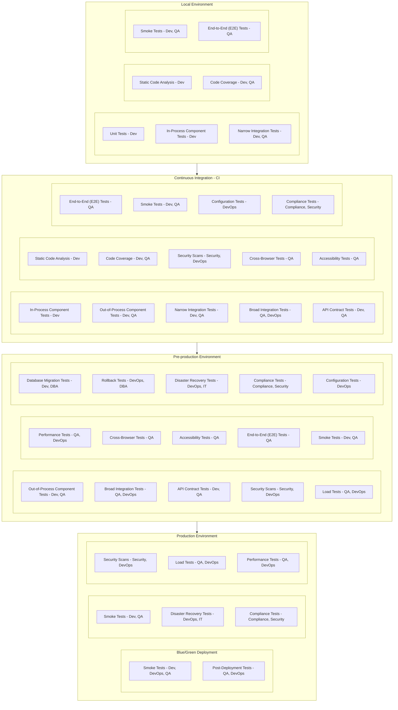
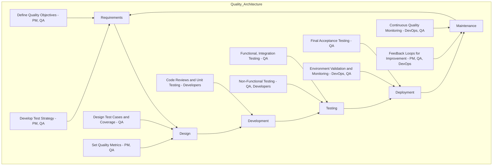

+++
title = "Building Quality: Aligning Test Strategies with the SDLC"
LastModifierDisplayName = "Alain Bouchard"
LastModifierEmail = "abouchard@live.ca"
disableToc = "false"
+++



We often discuss concepts like **SDLC (Software Development Life Cycle)** or a **Test Strategy**, but rarely do we focus on how to seamlessly integrate the test strategy into the SDLC. This is crucial because a test strategy isn’t just a standalone document — it’s a roadmap that ensures quality throughout each phase of development.

While many people understand what the SDLC is, they may not fully grasp the **goals, activities, or expected outcomes** of each phase. Each phase, from requirements to maintenance, plays a unique role in shaping the final product, and testing must align with these stages to maximize efficiency and quality.

To make this integration clear, we need to focus on **test types**, **where** to run them, and **who** is responsible.  It will be covered later in this article.

By aligning the test strategy with the SDLC, everyone - from developers to QA, including DevOps, Security, IT and Compliance people — knows their role in ensuring quality, and testing becomes an integral part of the development process, not an afterthought.

## Test Flow by Environment

The **Test Pyramid** has become a buzzword in testing conversations, often paired with trendy concepts like **shift left** and **shift right**. While these ideas are valuable, let’s take a step back and explore testing through the lens of a **typical deployment flow**, grounding the discussion in practical terms.

In this section, we’ll dive into an exhaustive list of test types that ensure a robust testing strategy. These will include:

- **Functional Tests**: Focus on verifying the application's functionality, including unit, integration, and end-to-end tests.  
- **Non-Functional Tests**: Cover aspects like performance, scalability, usability, and accessibility.  
- **Security Tests**: Assess the application's resilience to threats and ensure data protection.  
- **Analytic Tests**: Validate data accuracy, tracking, and reporting mechanisms.  
- **Compliance Tests**: Ensure adherence to regulatory, legal, and organizational standards.  
- **Business Continuity Tests**: Test disaster recovery, backup, rollback mechanisms, and other continuity measures.  
- **Deployment Strategy Tests**: Validate deployment approaches such as blue/green, canary, and rolling deployments.  
- **Compatibility Tests**: Ensure the application works across various browsers, devices, and operating systems.  
- **Data Integrity Tests**: Verify the accuracy, consistency, and reliability of data across systems.  
- **Localization and Internationalization Tests**: Ensure the application functions correctly in different regions and languages.  

By aligning these tests with SDLC, we aim to create a clear, actionable roadmap for delivering high-quality software.
### Test Flow Diagram

The diagram below represents a **per-environment test flow**, outlining the **environments, test types**, and their **owners**. While this flow is designed around typical industry practices, it’s important to note that every organization may have different environments, naming conventions, or even responsibilities assigned to teams.

The **responsibilities** listed in this flow align with standard industry roles, but these may vary depending on a company’s structure or specific needs. Additionally, **adding quality and test coverage is an iterative process**, meaning that no single test strategy will cover every possible test type from the start. Instead, test strategies evolve over time to adapt to new challenges and ensure comprehensive quality.

### Test Description

This section presents **test types** in a clear and concise **table format**. The table includes the **test type**, the **environments** where it is typically executed, the **owners** responsible for the tests, and a **short description** of each test type.

While the information provided reflects **industry standards**, it is not a strict rule. Every organization may adapt these test types, environments, and responsibilities to fit their unique workflows and quality assurance strategies.

| **Test Type**                | **Environment(s)**                             | **Who**                        | **Description**                                                                                         |
|------------------------------|------------------------------------------------|--------------------------------|---------------------------------------------------------------------------------------------------------|
| **Unit Tests**               | Local, CI                                      | Developers                     | Verify individual functions or modules. Should run quickly in isolation and are ideal for CI.           |
| **In-Process Component Tests** | Local, CI                                  | Developers                     | Test individual components within the same process (e.g., an API controller with a mock database layer). This verifies component behavior without external dependencies. |
| **Out-of-Process Component Tests** | CI, Preprod                         | Developers, QA Engineers       | Test components with actual dependencies in separate processes (e.g., an API calling a real database or microservice). Verifies real interactions. |
| **Narrow Integration Tests** | Local, CI                                      | Developers, QA Engineers       | Test interactions between a few closely-related components or services within the same system boundary. Validates integrations, such as between modules or a service and its database. |
| **Broad Integration Tests**  | CI, Preprod                                    | QA Engineers, DevOps           | Test larger cross-system or cross-boundary integrations, like microservices or third-party APIs. Ensures multiple components interact correctly. |
| **API Contract Tests**       | Local, CI, Preprod                             | Developers, QA Engineers       | Ensure APIs adhere to specified contracts, helping prevent breaking changes.                            |
| **Static Code Analysis**     | Local, CI                                      | Developers                     | Analyze code quality (e.g., linting). Typically run in CI and locally to catch style issues early.      |
| **Code Coverage**            | Local, CI                                      | Developers, QA Engineers       | Assess the percentage of code exercised by tests, typically monitored in CI.                            |
| **Security Scans**           | CI, Preprod, Prod                              | Security Engineers, DevOps     | Detect security vulnerabilities; best run in CI and preprod, with continuous monitoring in prod.        |
| **Load Tests**               | Preprod, Prod (if isolated)                    | QA Engineers, DevOps           | Evaluate system performance under load; run in preprod to avoid impact, validated in production when feasible. |
| **Performance Tests**        | Preprod, Prod (controlled)                     | QA Engineers, DevOps           | Test system speed and response under normal load. Can run in preprod, occasionally in production.       |
| **Cross-Browser Tests**      | CI, Preprod                                    | QA Engineers                   | Verify UI functionality across browsers; CI for regular checks, preprod for critical flows.            |
| **Accessibility Tests**      | CI, Preprod                                    | QA Engineers                   | Ensure app is accessible (e.g., WCAG standards). Run in CI for consistency, preprod for final check.   |
| **End-to-End (E2E) Tests**   | Local, CI, Preprod                             | QA Engineers                   | Simulate full user flows; run in CI for main paths, preprod for final verification.                    |
| **Smoke Tests**              | Local, CI, Preprod, Prod (Blue/Green)          | Developers, DevOps, QA Engineers | Basic functionality check to verify stability in each environment. Often executed on both blue and green environments in production to validate stability before and after deployment. |
| **Post-Deployment Tests**    | Prod (Blue/Green)                              | QA Engineers, DevOps           | Comprehensive testing (e.g., E2E, performance) conducted on the newly deployed environment to confirm stability and functionality before the switch. |
| **Database Migration Tests** | Preprod                                        | Developers, Database Administrators | Ensure database changes deploy correctly; should run in preprod to confirm migration stability.         |
| **Rollback Tests**           | Preprod                                        | DevOps, Database Administrators | Test rollback strategy if deployment fails; typically run in preprod for validation.                   |
| **Disaster Recovery Tests**  | Preprod, Prod (if feasible)                    | DevOps, IT Operations          | Ensure recovery process works; ideal in preprod, with periodic validation in production.               |
| **Compliance Tests**         | CI, Preprod, Prod                              | Compliance Officers, Security Engineers | Confirm compliance requirements are met (e.g., GDPR). Run in CI/preprod and monitor in prod.           |
| **Configuration Tests**      | CI, Preprod                                    | DevOps                         | Check for proper configuration settings; primarily CI with validation in preprod.                      |

## Software Development Life Cycle (SDLC)

### What is SDLC?

The Software Development Life Cycle (SDLC) is a structured process guiding software projects from start to finish. Each phase has specific goals, activities, and deliverables that build on each other to ensure successful development and maintenance. The following table are the key SDLC phases:

| **Phase**                | **Goal**                                | **Activities**                                                                                  | **Outcome**                                      |
|--------------------------|-----------------------------------------|------------------------------------------------------------------------------------------------|-------------------------------------------------|
| **Requirements**         | Define what the software needs to do.  | Gather and document requirements with stakeholders.                                            | Clear requirements for design and development.  |
| **Design**               | Create a blueprint for the software.   | Define architecture, interfaces, databases, and plan security and scalability.                 | Detailed design documents and diagrams.         |
| **Development**          | Build the software.                    | Write code, create unit tests, and conduct code reviews.                                       | Working prototype or complete software.         |
| **Testing**              | Ensure the software meets quality.     | Perform unit, integration, system, and user acceptance testing (UAT). Fix any issues.          | Stable version ready for deployment.            |
| **Deployment**           | Release the software for use.          | Deploy software to production, monitor, and run acceptance tests.                              | Live, functioning product accessible to users.  |
| **Maintenance & Support**| Keep the software functional post-release. | Monitor, fix bugs, apply patches, and implement enhancements based on feedback.                | Continuous support and updates until retirement.|

This table provides a concise overview of each phase, including its purpose, activities, and outcomes.

### The Test Strategy within the SDLC

Mapping the **Test Strategy** over the **SDLC phases** can create a comprehensive quality framework, ensuring that quality standards are integrated at each step. This approach establishes quality checkpoints and testing strategies throughout the development process. Here’s how each phase can incorporate elements of the quality architecture:

#### 1. **Requirements Gathering and Analysis**
   - **Quality Objectives**: Define quality standards, acceptance criteria, and regulatory requirements with input from all stakeholders.
   - **Test Strategy and Planning**: Outline an initial test plan, including types of testing required (functional, security, performance) and establish early quality metrics.
   - **Roles and Responsibilities**: Product Managers (PM) and QA collaborate to create clear, testable requirements and acceptance criteria.

#### 2. **System Design**
   - **Test Design and Coverage**: Develop test cases and design documents that map directly to requirements, focusing on both functional and non-functional requirements.
   - **Quality Metrics**: Define metrics like test coverage, complexity, and maintainability as part of design specifications.
   - **Automation Planning**: Determine areas for automated testing (such as unit and integration tests) and establish CI/CD integration points.
   - **Roles and Responsibilities**: QA and DevOps engage with developers to ensure testability, and DevOps designs CI/CD pipeline for early test integration.

#### 3. **Development**
   - **Code Quality and Reviews**: Developers follow coding standards and conduct code reviews for quality assurance. Automated tools, like linters and static code analysis, can be incorporated here.
   - **Unit Testing and Test Coverage**: Implement unit tests for individual components and monitor test coverage as code is developed.
   - **Continuous Integration (CI)**: Use CI tools to automatically build and run tests with each code commit to catch issues early.
   - **Roles and Responsibilities**: Developers write and run unit tests, and QA may validate test case coverage.

#### 4. **Testing**
   - **Functional Testing**: QA executes functional, integration, and end-to-end tests to verify that all requirements are met.
   - **Non-Functional Testing**: Perform performance, security, and usability testing to evaluate software robustness under different scenarios.
   - **Automated Regression Testing**: Run automated regression tests on each new build to ensure new changes don’t introduce defects.
   - **Quality Metrics and Monitoring**: Track defect density, test coverage, and test pass rates. Analyze results to inform potential fixes or improvements.
   - **Roles and Responsibilities**: QA leads testing efforts, with developers addressing reported issues, and DevOps maintaining test environments.

#### 5. **Deployment**
   - **Environment Validation**: Ensure the production environment is consistent and validated against pre-deployment criteria.
   - **Final Acceptance Testing**: Conduct final smoke tests or sanity checks to confirm functionality in the production-like environment.
   - **Monitoring Setup**: Set up application and quality monitoring for post-deployment analysis.
   - **Roles and Responsibilities**: DevOps manages deployment and monitoring setup, while QA ensures final tests are successful.

#### 6. **Maintenance and Support**
   - **Continuous Quality Monitoring**: Track production metrics like uptime, response time, and error rates. Use monitoring tools to identify issues and trends.
   - **Defect Management**: Prioritize and fix bugs identified in production, using insights to refine tests and improve future releases.
   - **Feedback Loops**: Implement customer feedback and production incident reports to continually improve quality standards and test cases.
   - **Roles and Responsibilities**: QA and DevOps collaborate on monitoring, with developers addressing production issues, and PM integrating customer feedback.

### Quality and SDLC Flow

## Conclusion

This article is focusing on how to align **Testing Strategies** with the **Software Development Life Cycle (SDLC)** to ensure quality at every stage of development. We looked at how different test types fit into the SDLC and how responsibilities are distributed among teams.

Key points covered:
- The SDLC provides a clear roadmap with goals, activities, and outcomes for each phase.  
- Tests can be grouped into categories like functional, non-functional, security, and compliance to make sure all areas are covered.  
- Responsibilities and environments may differ across organizations, so it’s important to adapt industry standards to your specific needs.
- Ensuring quality is essential at every phase of the SDLC.

Testing is a process that evolves over time, and this article insights highlight the value of collaboration and continuous improvement to build high-quality software.