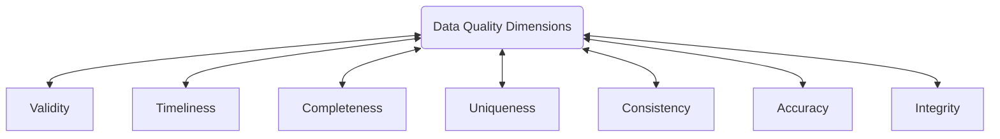

+++
title = "Apache Quality"
LastModifierDisplayName = "Alain Bouchard"
LastModifierEmail = "abouchard@live.ca"
disableToc = "false"
+++



## Data Quality and Data Management 101

### What is Data Quality Definition?

- In the Data and Business Intelligence domain, Data Quality refers to the overall accuracy, completeness, reliability, and relevance of data, ensuring that it is fit for its intended use
- In essence, Data Quality ensures that the data used in business intelligence efforts is trustworthy, allowing for accurate analysis, reporting, and decision-making
- Data quality is defined by how well a given dataset meets a user's need. Data quality is an important criteria for ensuring that data-driven decisions are made as accurately as possible

### What is Data Quality Management (DQM) and its pillars?

- **People**: the involvement of the data stewards, analyst and business users who are responsible for setting data standards, monitoring quality, and resolving issues.  These roles ensure alignment alignment between business needs and the data used to support them.
- **Data Profiling**: a critical step that involves analyzing the current state of the data by examining its structure, patterns, and anomalies.  Data profiling helps uncover quality issues such as duplicates, missing values, and inconsistencies, enabling organizations to identify areas needing improvement. It is initiated to understand the current state of existing data by comparing data to data standards as set by the DQM, used to define the benchmarks to evaluate the improvements. 
- **Defining Data Quality**: establishing clear, measurable data quality dimensions such as accuracy, completeness, timeliness and consistency.  These criteria are developed based on business needs and objectives, ensuring that data supports decision-making and operations effectively.  What the data should look like, and it is based on the business goals 
- **Data Reporting**: providing regular insights and metrics on the state of data quality through dashboards audits, and scorecards. This reporting enable stakeholders to monitor progress, identify trends, and make informed decisions about improvements and corrective actions. It will return the DQM "return on the investment" (ROI), and how data compares to the defined data quality benchmarks.
- **Data Fixing**: implementing corrective actions to resolve data quality issues, including data cleansing, standardization, and deduplication.  It also involves root cause analysis to prevent recurring issues by addressing underlying process or system flaws. It is intended to repair the data that doesn't meet the defined data quality benchmarks and standards. Improving data to the required standards.

Most important pillar is probably the People one.

### What is the Impact of Poor Data Quality

Poor data quality can have significant negative impacts on a business across various dimensions:

- decision-making,
- operational efficiency, 
- financial performance/missed opportunities, and
- customer trust/reputation risk.

Key impacts include:

- **Inaccurate Decision-Making**: poor data quality leads to faulty analysis and reporting, causing executives and managers to base strategic and operation decisions on incorrect or incomplete information.  This can result in missed opportunities, flawed strategies, or inappropriate response to market conditions. The data based decisions and policies are only as good as the data they are based on.
- **Reduced Operational Efficiency**: when data is inaccurate or inconsistent, processes such ad data integration, analysis, and reporting take longer and require more manual intervention. This leads to inefficiencies, increased labor costs, and delayed operations, affecting productivity.
- **Financial Losses**: poor data quality can directly impact revenue by causing billing errors, incorrect pricing, or inventory mismanagement. It also increases costs due to rework compliance fines, or failed marking campaigns based on bad data. For example, failure to deliver service to customers or failure to sale the relevant contacts. 
- **Customer dissatisfaction**: errors in customer data, such as wrong addresses or incorrect orders, can result in poor customer experiences, damaged relationships, and loss of trust. This can lead to increased customer churn and negative brand reputation.
- **Regulatory and Compliance risks**:: in industries with strict regulatory requirements (e.g., finance, healthcare, etc), poor data quality can lead to non-compliance, legal penalties, and damage to the organization's credibility. For example, GDPR issues and negative media coverage.
- **Loss of competitive advantage**: businesses that fail to manage data quality effectively may fall behind competitors that leverage clean, accurate data for better market insights, customer targeting, and innovation.

In conclusion, poor data quality undermines the reliability and value of business intelligence (BI)., impacting nearly every aspect of the business, from dat-to-day operations to long-term growth and competitiveness.

### Real-life Examples

There are several real-life examples where poor data quality had a significant impact on businesses:

- **Knight Capital Group**: in 2012, a software glitch caused the firm to make unintended stock trades, resulting in a $ 440 million loss within 45 minutes. This error was linked to poor data handling and led to the firm's eventual bankruptcy. [[GetRightData]]
- **Boeing 747 Max Crashes: Faulty sensor data triggered the automated flight control system, contributing to two fatal crashes in 2018 and 2019. Boeing lost billions, and the incidents resulted in the grounding of all 737 Max planes. [[GetRightData]]
- **UK Passport Agency**: in 1999, data migration errors during a system upgrade delayed the insurance of 500K passports.  The fallout from these data issues led to public outrage and a cost of around £12.6 millions to resolve. [[GetRightData]]
- **NASA Mars Orbiter**: NASA lost a $125 million Mars orbiter because a Lockheed Martin engineering team used English units of measurement while the agency's team used the more conventional metric system for a key spacecraft operation. [[CNN_NASA]]

These examples demonstrate how critical accurate data is in preventing financial losses, reputation damage, and even human safety risks.

More cases are documented on [[GetRightData]].

## Causes of Bad Data

Bad data can arise due to due to various reasons, typically stemming from issues in data collection, management, and governance. Here are some reasons why we encounter poor data quality:

- **Human Error** 
  - **Manual Data Entry**: people can make mistakes when entering data, leading to inaccuracies, misspellings, and incomplete records. For example, typographical errors or incorrect formatting can lead to inconsistencies in databases.
  - **Lack of Training**: when data entry personnel aren't adequately trained, they may unintentionally introduce systemic errors.  This happens when employees unknowingly enter incomplete or incorrect data, which accumulates and impacts the overall quality of the dataset.
- **Inadequate Data Validation**
  - **Missing Validation Rules**: without proper validation checks, systems can let through invalid data like incorrect formats or data types (for instance, entering letters when numbers are expected). These gaps can lead to faulty or unusable data being stored.
  - **Inconsistent Standards**: when different departments or systems use varying data formats and standards, it results in inconsistencies across the organization, making it difficult to maintain clean and reliable data.
- **Integration Errors** 
  - **Data from Multiple Sources**: merging data from various sources, such as legacy systems or third-party vendors, often introduces discrepancies. Differences in data structures or formats can lead to duplicated records, missing information, or incorrect data being captured.
  - **Incorrect Mapping or Transformation**: during migrations or updates, if data fields aren't mapped properly, or if transformation rules are incorrect, it can lead to distorted or corrupted data.
- **Outdated Information**
  - **Stale Data**: information can become outdated if not updated regularly. This is especially common with customer records like contact details, which change frequently over time.
  - **Lag in Data Updates**: some systems don't update data in real time, leading to discrepancies between what's recorded and actual events, which can cause issues in decision-making.
- **Lack of Data Governance**
  - **No Clear Ownership**: when there's no assigned responsibility for data management, inconsistent practices across departments can result in poor data quality.  Without ownership, it's hard to maintain data standards.
  - **Unstructured Data Management**: without clear policies and structured processes for managing storing, and cleaning data, its quality tends to degrade, leading to inaccurate or complete data.
- **Incomplete Data**
  - **Partial Data Entry**: sometimes, important data fields are left out during entry, leading to incomplete records. This can happen when systems don't enforce required fields, making the data unreliable.
  - **Legacy Systems**: older systems might not capture all necessary data, leaving gaps when this information i used in modern analytics or business intelligence platforms. 
- **Technical Errors**
  - **System Failures**: technical issues like system crashes, corrupted files, or failed data transfers can lead to incomplete or inaccurate data.
  - **Software Bugs**: bugs in data processing tools or software can introduce errors, reading faulty data that affects overall insights and decision-making.

In conclusion, each of these factors highlights the need for solid **DQM** practices, such as robust validation, regular data cleaning, and strong governance to keep data accurate and reliable. 

## Data Quality Dimensions

### Overview

**Data Quality Dimensions** refer to the different ways we measure how good our data is.

Here's some of the most recognized dimensions:

- **Accuracy**: this is all about how closely the data matches real-world facts. If your data doesn’t reflect reality, it can lead to bad decisions. 
- **Completeness**: it checks if all the necessary information is present. Missing data can leave important gaps, making the data unreliable.
- **Consistency**: data should be the same across all systems. For example, if one database says a customer lives in New York and another says they live in California, that's inconsistent and can cause confusion.
- **Timelessness**: how current is the data? Old or delayed information can lead to missed opportunities or wrong conclusions.
- **Validity**: this looks at whether the data follows the required rules or formats. For instance, you wouldn’t want letters in a field that should only have numbers. 
- **Uniqueness**: there shouldn’t be duplicates. If the same person or thing is entered twice, it skews the results and creates inefficiencies. 
- **Integrity**: this ensures that relationships within the data are properly maintained. For example, if a customer is linked to an order, that link should always stay intact.

In summary, these dimensions help ensure that your data is trustworthy and usable for making informed business decisions.

### Example of Accuracy Issue

Here’s an example of a **data accuracy issue** using a customer list:

| Customer ID | First Name | Last Name | Address                | City          | Zip Code |
|-------------|------------|-----------|------------------------|---------------|----------|
| 101         | John       | Smith     | 123 Elm St             | Springfield   | 01105    |
| 102         | Jane       | Doe       | 456 Oak Ave            | Shelbyville   | 12345    |
| 103         | Jonh       | Smtih     | 123 Elm Street         | Springfield   | 1105     |
| 104         | Emma       | Johnson   | 789 Maple Blvd         | Capital City  | 54321    |

**Issue**:
In this table, **Customer ID 103** has multiple accuracy errors:
- **First Name**: "Jonh" should be "John."
- **Last Name**: "Smtih" should be "Smith."
- **Address**: "123 Elm Street" is an incorrect variation of "123 Elm St."
- **Zip Code**: The entry "1105" is missing a digit; it should be "01105."

These inaccuracies could lead to problems like sending mail to the wrong address, duplicate entries for the same person, or errors in customer service interactions. 

This highlights how inaccurate data can cause operational inefficiencies and poor customer experiences.

### Example of Completeness Issue

Here’s an example of a **data completeness issue** using the customer list:

| Customer ID | First Name | Last Name | Address        | City         | Zip Code |
|-------------|------------|-----------|----------------|--------------|----------|
| 101         | John       | Smith     | 123 Elm St     | Springfield  | 01105    |
| 102         | Jane       | Doe       | 456 Oak Ave    | Shelbyville  | 12345    |
| 103         | Jonh       | Smtih     |                | Springfield  | 1105     |
| 104         | Emma       |           | 789 Maple Blvd | Capital City | 54321    |

**Completeness Issues**:
- **Customer 103**: The **Address** field is missing, leaving out critical information needed for communications or shipments.
- **Customer 104**: The **Last Name** is missing, making it impossible to fully identify this customer, especially if there are multiple people named "Emma."

Incomplete data like this can cause issues such as failed deliveries, incorrect customer segmentation, or difficulties in contacting the customer.

### Example of Consistency Issue

Here’s an example of a **data consistency issue** using the customer list:

| Customer ID | First Name | Last Name | Address          | City         | Zip Code |
|-------------|------------|-----------|------------------|--------------|----------|
| 101         | John       | Smith     | 123 Elm St       | Springfield  | 01105    |
| 102         | Jane       | Doe       | 456 Oak Ave      | Shelbyville  | 12345    |
| 103         | Jonh       | Smtih     | 123 Elm Street   | Springfield  | 1105     |
| 104         | Emma       | Johnson   | 789 Maple Blvd   | Capital City | 54321    |

**Consistency Issues**:
- **Customer 103**: The **Address** is listed as "123 Elm Street" instead of "123 Elm St," which is an inconsistency in the format of the same address as Customer 101.
- **Customer 103**: The **Zip Code** is "1105" instead of "01105," showing inconsistency in the zip code format (missing leading zero).

Inconsistent data like this creates confusion and inefficiencies, as different systems may not recognize the same entity when information is presented in various formats. This can lead to duplicate records or incorrect data processing.

### Example of Timelessness Issue

Here’s an example of a **data timeliness issue** using the customer list:

| Customer ID | First Name | Last Name | Address           | City         | Zip Code | Last Updated |
|-------------|------------|-----------|-------------------|--------------|----------|--------------|
| 101         | John       | Smith     | 123 Elm St        | Springfield  | 01105    | 2024-09-01   |
| 102         | Jane       | Doe       | 456 Oak Ave       | Shelbyville  | 12345    | 2024-09-01   |
| 103         | Jonh       | Smtih     | 123 Elm Street    | Springfield  | 01105    | 2021-06-15   |
| 104         | Emma       | Johnson   | 789 Maple Blvd    | Capital City | 54321    | 2022-03-10   |

**Timeliness Issues**:
- **Customer 103**: The **Last Updated** date is from 2021, making this record outdated. Since the address and contact details haven't been verified or updated in over two years, it's possible that the data is no longer accurate.
- **Customer 104**: The data was last updated in early 2022, which also makes it outdated for a customer who might have changed address or contact information since then.

Outdated records like these could lead to problems such as sending communications or deliveries to the wrong address, missing customer preferences, or failing to capture changes that impact business decisions. Timely data updates are crucial to maintaining the reliability of customer information.

### Example of Validity Issue

Here’s an example of a **data validity issue** using the customer list:

| Customer ID | First Name | Last Name | Address          | City         | Zip Code | Email                  |
|-------------|------------|-----------|------------------|--------------|----------|------------------------|
| 101         | John       | Smith     | 123 Elm St       | Springfield  | 01105    | john.smith@email.com    |
| 102         | Jane       | Doe       | 456 Oak Ave      | Shelbyville  | 12345    | jane.doe@email.com      |
| 103         | Jonh       | Smtih     | 123 Elm Street   | Springfield  | 1105     | jonh.smtih@email..com   |
| 104         | Emma       | Johnson   | 789 Maple Blvd   | Capital City | 54321    | emma@invalidemail@com   |

**Validity Issues**:
- **Customer 103**: The email address "jonh.smtih@email..com" contains a formatting error (extra period before ".com"), which is invalid.
- **Customer 104**: The email "emma@invalidemail@com" has two "@" symbols, which is not allowed in email formatting, making it invalid.

In cases like these, data validity rules (e.g., proper email formats, correct zip code length, or valid data types) must be enforced. Invalid data such as incorrect email formats could result in failed communications and missed customer interactions, highlighting the importance of ensuring data conforms to required standards.

### Example for Uniqueness Issue

Here’s an example of a **data uniqueness issue** using the customer list:

| Customer ID | First Name | Last Name | Address          | City         | Zip Code  | Email                   |
|-------------|------------|-----------|------------------|--------------|-----------|-------------------------|
| 101         | John       | Smith     | 123 Elm St       | Springfield  | 01105     | john.smith@email.com     |
| 102         | Jane       | Doe       | 456 Oak Ave      | Shelbyville  | 12345     | jane.doe@email.com       |
| 103         | Jonh       | Smtih     | 123 Elm Street   | Springfield  | 01105     | jonh.smtih@email.com     |
| 104         | Emma       | Johnson   | 789 Maple Blvd   | Capital City | 54321     | emma.johnson@email.com   |
| 105         | John       | Smith     | 123 Elm St       | Springfield  | 01105     | john.smith@email.com     |

**Uniqueness Issues**:
- **Customer 101 and Customer 105**: These entries are duplicates, representing the same individual (John Smith) with identical information (address, email, etc.). However, they have different **Customer IDs**, which indicates a lack of uniqueness in the dataset.

Duplicate records like this can lead to inefficiencies, such as multiple mailings to the same person, errors in customer segmentation, and skewed analytics. Ensuring uniqueness, especially in key fields like Customer ID or email, is crucial to maintaining data integrity.

### Example of Integrity Issues

Here’s an example of a **data integrity issue** using a customer list and an associated order table:

**Customer Table**:
| Customer ID | First Name | Last Name | Address          | City         | Zip Code  |
|-------------|------------|-----------|------------------|--------------|-----------|
| 101         | John       | Smith     | 123 Elm St       | Springfield  | 01105     |
| 102         | Jane       | Doe       | 456 Oak Ave      | Shelbyville  | 12345     |
| 103         | Jonh       | Smtih     | 123 Elm Street   | Springfield  | 01105     |
| 104         | Emma       | Johnson   | 789 Maple Blvd   | Capital City | 54321     |

**Order Table**:
| Order ID | Customer ID | Order Date | Order Amount |
|----------|-------------|------------|--------------|
| 5001     | 101         | 2024-09-01 | $150         |
| 5002     | 105         | 2024-09-02 | $200         |
| 5003     | 104         | 2024-09-03 | $250         |

**Integrity Issues**:
- **Customer ID in Order Table**: In the Order Table, **Order 5002** refers to **Customer ID 105**, which does not exist in the **Customer Table**. This indicates a **referential integrity** problem, where a record in the Order Table is pointing to a non-existent customer.
- **Mismatch of Addresses**: In the Customer Table, **Customer 103** has the same address as **Customer 101** but with variations (e.g., "Elm Street" vs. "Elm St."), which could also indicate an integrity issue in maintaining consistent data relationships.

Data integrity ensures that relationships between tables (e.g., customer and order data) are accurate and complete. Integrity issues like these can lead to broken reporting, incorrect data analysis, and operational inefficiencies.

### Multiple Data Quality Dimensions Issues

A single issue, like an address problem, can involve **multiple data quality dimensions** at once. Here's how:

1. **Accuracy**: if the address is wrong (e.g., "123 Elm St" instead of "321 Elm St"), it’s an accuracy issue. This can cause real problems, like sending packages to the wrong place or communicating with the customer at the wrong address.
2. **Completeness**: if part of the address is missing, such as no zip code or an incomplete street name (e.g., “Elm St” without the house number), that’s a completeness issue. Without the full details, the address may not be useful, and the business can't function properly.
3. **Integrity**: data integrity is about making sure information is consistent across systems. If one system shows "123 Elm St" and another has "456 Oak Ave" for the same person, it’s an integrity problem, as these records don't match.

So, a simple issue like an incorrect or incomplete address can affect **accuracy**, **completeness**, and **integrity** all at the same time, making it crucial to fix the issue from multiple angles to ensure the data is reliable.

## Data Quality Rules

## Data Quality Techniques

## Data Quality Roles

## Data Quality Process

## Data Quality Tools

## Data Governance or Data Quality Management

## Best Practices

<!-- links -->

[GetRightData]: https://www.getrightdata.com/resources/why-quality-matters-the-10-biggest-data-quality-disasters
[CNN_NASA]: http://www.cnn.com/TECH/space/9909/30/mars.metric.02/
