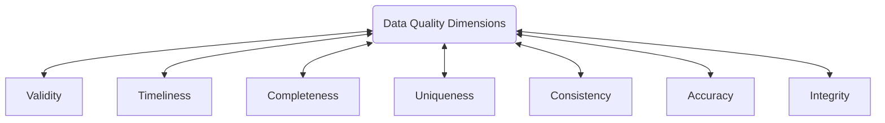
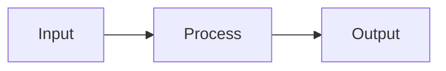
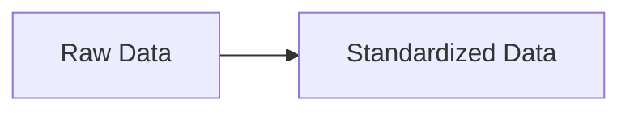
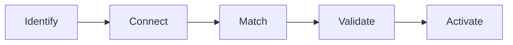
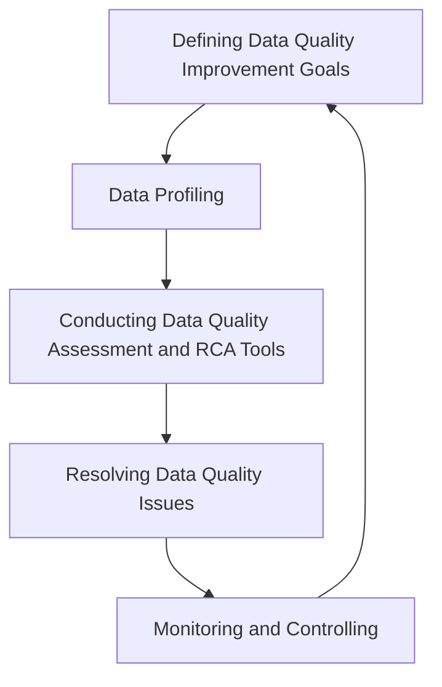
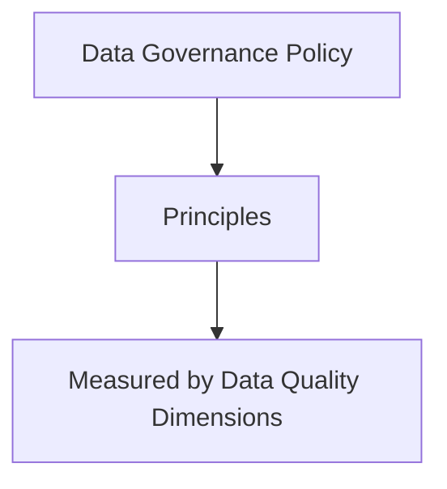

+++
title = "Data Quality"
LastModifierDisplayName = "Alain Bouchard"
LastModifierEmail = "abouchard@live.ca"
disableToc = "false"
+++



## Data Quality and Data Management 101

### What is Data Quality Definition?

- In the Data and Business Intelligence domain, Data Quality refers to the overall accuracy, completeness, reliability, and relevance of data, ensuring that it is fit for its intended use
- In essence, Data Quality ensures that the data used in business intelligence efforts is trustworthy, allowing for accurate analysis, reporting, and decision-making
- Data quality is defined by how well a given dataset meets a user's need. Data quality is an important criteria for ensuring that data-driven decisions are made as accurately as possible

### What is Data Quality Management (DQM) and its pillars?

- **People**: the involvement of the data stewards, analyst and business users who are responsible for setting data standards, monitoring quality, and resolving issues. These roles ensure alignment alignment between business needs and the data used to support them.
- **Data Profiling**: a critical step that involves analyzing the current state of the data by examining its structure, patterns, and anomalies. Data profiling helps uncover quality issues such as duplicates, missing values, and inconsistencies, enabling organizations to identify areas needing improvement. It is initiated to understand the current state of existing data by comparing data to data standards as set by the DQM, used to define the benchmarks to evaluate the improvements.
- **Defining Data Quality**: establishing clear, measurable data quality dimensions such as accuracy, completeness, timeliness and consistency. These criteria are developed based on business needs and objectives, ensuring that data supports decision-making and operations effectively. What the data should look like, and it is based on the business goals
- **Data Reporting**: providing regular insights and metrics on the state of data quality through dashboards audits, and scorecards. This reporting enable stakeholders to monitor progress, identify trends, and make informed decisions about improvements and corrective actions. It will return the DQM "return on the investment" (ROI), and how data compares to the defined data quality benchmarks.
- **Data Fixing**: implementing corrective actions to resolve data quality issues, including data cleansing, standardization, and deduplication. It also involves root cause analysis to prevent recurring issues by addressing underlying process or system flaws. It is intended to repair the data that doesn't meet the defined data quality benchmarks and standards. Improving data to the required standards.

Most important pillar is probably the People one.

### What is the Impact of Poor Data Quality

Poor data quality can have significant negative impacts on a business across various dimensions:

- decision-making,
- operational efficiency,
- financial performance/missed opportunities, and
- customer trust/reputation risk.

Key impacts include:

- **Inaccurate Decision-Making**: poor data quality leads to faulty analysis and reporting, causing executives and managers to base strategic and operation decisions on incorrect or incomplete information. This can result in missed opportunities, flawed strategies, or inappropriate response to market conditions. The data based decisions and policies are only as good as the data they are based on.
- **Reduced Operational Efficiency**: when data is inaccurate or inconsistent, processes such ad data integration, analysis, and reporting take longer and require more manual intervention. This leads to inefficiencies, increased labor costs, and delayed operations, affecting productivity.
- **Financial Losses**: poor data quality can directly impact revenue by causing billing errors, incorrect pricing, or inventory mismanagement. It also increases costs due to rework compliance fines, or failed marking campaigns based on bad data. For example, failure to deliver service to customers or failure to sale the relevant contacts.
- **Customer dissatisfaction**: errors in customer data, such as wrong addresses or incorrect orders, can result in poor customer experiences, damaged relationships, and loss of trust. This can lead to increased customer churn and negative brand reputation.
- **Regulatory and Compliance risks**:: in industries with strict regulatory requirements (e.g., finance, healthcare, etc), poor data quality can lead to non-compliance, legal penalties, and damage to the organization's credibility. For example, GDPR issues and negative media coverage.
- **Loss of competitive advantage**: businesses that fail to manage data quality effectively may fall behind competitors that leverage clean, accurate data for better market insights, customer targeting, and innovation.

In conclusion, poor data quality undermines the reliability and value of business intelligence (BI)., impacting nearly every aspect of the business, from dat-to-day operations to long-term growth and competitiveness.

### Real-life Examples

There are several real-life examples where poor data quality had a significant impact on businesses:

- **Knight Capital Group**: in 2012, a software glitch caused the firm to make unintended stock trades, resulting in a $ 440 million loss within 45 minutes. This error was linked to poor data handling and led to the firm's eventual bankruptcy. [[GetRightData]]
- \*\*Boeing 747 Max Crashes: Faulty sensor data triggered the automated flight control system, contributing to two fatal crashes in 2018 and 2019. Boeing lost billions, and the incidents resulted in the grounding of all 737 Max planes. [[GetRightData]]
- **UK Passport Agency**: in 1999, data migration errors during a system upgrade delayed the insurance of 500K passports. The fallout from these data issues led to public outrage and a cost of around £12.6 millions to resolve. [[GetRightData]]
- **NASA Mars Orbiter**: NASA lost a $125 million Mars orbiter because a Lockheed Martin engineering team used English units of measurement while the agency's team used the more conventional metric system for a key spacecraft operation. [[CNN_NASA]]

These examples demonstrate how critical accurate data is in preventing financial losses, reputation damage, and even human safety risks.

More cases are documented on [[GetRightData]].

## Causes of Bad Data

Bad data can arise due to due to various reasons, typically stemming from issues in data collection, management, and governance. Here are some reasons why we encounter poor data quality:

- **Human Error**
  - **Manual Data Entry**: people can make mistakes when entering data, leading to inaccuracies, misspellings, and incomplete records. For example, typographical errors or incorrect formatting can lead to inconsistencies in databases.
  - **Lack of Training**: when data entry personnel aren't adequately trained, they may unintentionally introduce systemic errors. This happens when employees unknowingly enter incomplete or incorrect data, which accumulates and impacts the overall quality of the dataset.
- **Inadequate Data Validation**
  - **Missing Validation Rules**: without proper validation checks, systems can let through invalid data like incorrect formats or data types (for instance, entering letters when numbers are expected). These gaps can lead to faulty or unusable data being stored.
  - **Inconsistent Standards**: when different departments or systems use varying data formats and standards, it results in inconsistencies across the organization, making it difficult to maintain clean and reliable data.
- **Integration Errors**
  - **Data from Multiple Sources**: merging data from various sources, such as legacy systems or third-party vendors, often introduces discrepancies. Differences in data structures or formats can lead to duplicated records, missing information, or incorrect data being captured.
  - **Incorrect Mapping or Transformation**: during migrations or updates, if data fields aren't mapped properly, or if transformation rules are incorrect, it can lead to distorted or corrupted data.
- **Outdated Information**
  - **Stale Data**: information can become outdated if not updated regularly. This is especially common with customer records like contact details, which change frequently over time.
  - **Lag in Data Updates**: some systems don't update data in real time, leading to discrepancies between what's recorded and actual events, which can cause issues in decision-making.
- **Lack of Data Governance**
  - **No Clear Ownership**: when there's no assigned responsibility for data management, inconsistent practices across departments can result in poor data quality. Without ownership, it's hard to maintain data standards.
  - **Unstructured Data Management**: without clear policies and structured processes for managing storing, and cleaning data, its quality tends to degrade, leading to inaccurate or complete data.
- **Incomplete Data**
  - **Partial Data Entry**: sometimes, important data fields are left out during entry, leading to incomplete records. This can happen when systems don't enforce required fields, making the data unreliable.
  - **Legacy Systems**: older systems might not capture all necessary data, leaving gaps when this information i used in modern analytics or business intelligence platforms.
- **Technical Errors**
  - **System Failures**: technical issues like system crashes, corrupted files, or failed data transfers can lead to incomplete or inaccurate data.
  - **Software Bugs**: bugs in data processing tools or software can introduce errors, reading faulty data that affects overall insights and decision-making.

In conclusion, each of these factors highlights the need for solid **DQM** practices, such as robust validation, regular data cleaning, and strong governance to keep data accurate and reliable.

## Data Quality Dimensions

### Overview

**Data Quality Dimensions** refer to the different ways we measure how good our data is.



Here's some of the most recognized dimensions:

- **Accuracy**: this is all about how closely the data matches real-world facts. If your data doesn’t reflect reality, it can lead to bad decisions.
- **Completeness**: it checks if all the necessary information is present. Missing data can leave important gaps, making the data unreliable.
- **Consistency**: data should be the same across all systems. For example, if one database says a customer lives in New York and another says they live in California, that's inconsistent and can cause confusion.
- **Timelessness**: how current is the data? Old or delayed information can lead to missed opportunities or wrong conclusions.
- **Validity**: this looks at whether the data follows the required rules or formats. For instance, you wouldn’t want letters in a field that should only have numbers.
- **Uniqueness**: there shouldn’t be duplicates. If the same person or thing is entered twice, it skews the results and creates inefficiencies.
- **Integrity**: this ensures that relationships within the data are properly maintained. For example, if a customer is linked to an order, that link should always stay intact.

In summary, these dimensions help ensure that your data is trustworthy and usable for making informed business decisions.

### Example of Accuracy Issue

Here’s an example of a **data accuracy issue** using a customer list:

| Customer ID | First Name | Last Name | Address        | City         | Zip Code |
| ----------- | ---------- | --------- | -------------- | ------------ | -------- |
| 101         | John       | Smith     | 123 Elm St     | Springfield  | 01105    |
| 102         | Jane       | Doe       | 456 Oak Ave    | Shelbyville  | 12345    |
| 103         | Jonh       | Smtih     | 123 Elm Street | Springfield  | 1105     |
| 104         | Emma       | Johnson   | 789 Maple Blvd | Capital City | 54321    |

**Issue**:
In this table, **Customer ID 103** has multiple accuracy errors:

- **First Name**: "Jonh" should be "John."
- **Last Name**: "Smtih" should be "Smith."
- **Address**: "123 Elm Street" is an incorrect variation of "123 Elm St."
- **Zip Code**: The entry "1105" is missing a digit; it should be "01105."

These inaccuracies could lead to problems like sending mail to the wrong address, duplicate entries for the same person, or errors in customer service interactions.

This highlights how inaccurate data can cause operational inefficiencies and poor customer experiences.

### Example of Completeness Issue

Here’s an example of a **data completeness issue** using the customer list:

| Customer ID | First Name | Last Name | Address        | City         | Zip Code |
| ----------- | ---------- | --------- | -------------- | ------------ | -------- |
| 101         | John       | Smith     | 123 Elm St     | Springfield  | 01105    |
| 102         | Jane       | Doe       | 456 Oak Ave    | Shelbyville  | 12345    |
| 103         | Jonh       | Smtih     |                | Springfield  | 1105     |
| 104         | Emma       |           | 789 Maple Blvd | Capital City | 54321    |

**Completeness Issues**:

- **Customer 103**: The **Address** field is missing, leaving out critical information needed for communications or shipments.
- **Customer 104**: The **Last Name** is missing, making it impossible to fully identify this customer, especially if there are multiple people named "Emma."

Incomplete data like this can cause issues such as failed deliveries, incorrect customer segmentation, or difficulties in contacting the customer.

### Example of Consistency Issue

Here’s an example of a **data consistency issue** using the customer list:

| Customer ID | First Name | Last Name | Address        | City         | Zip Code |
| ----------- | ---------- | --------- | -------------- | ------------ | -------- |
| 101         | John       | Smith     | 123 Elm St     | Springfield  | 01105    |
| 102         | Jane       | Doe       | 456 Oak Ave    | Shelbyville  | 12345    |
| 103         | Jonh       | Smtih     | 123 Elm Street | Springfield  | 1105     |
| 104         | Emma       | Johnson   | 789 Maple Blvd | Capital City | 54321    |

**Consistency Issues**:

- **Customer 103**: The **Address** is listed as "123 Elm Street" instead of "123 Elm St," which is an inconsistency in the format of the same address as Customer 101.
- **Customer 103**: The **Zip Code** is "1105" instead of "01105," showing inconsistency in the zip code format (missing leading zero).

Inconsistent data like this creates confusion and inefficiencies, as different systems may not recognize the same entity when information is presented in various formats. This can lead to duplicate records or incorrect data processing.

### Example of Timelessness Issue

Here’s an example of a **data timeliness issue** using the customer list:

| Customer ID | First Name | Last Name | Address        | City         | Zip Code | Last Updated |
| ----------- | ---------- | --------- | -------------- | ------------ | -------- | ------------ |
| 101         | John       | Smith     | 123 Elm St     | Springfield  | 01105    | 2024-09-01   |
| 102         | Jane       | Doe       | 456 Oak Ave    | Shelbyville  | 12345    | 2024-09-01   |
| 103         | Jonh       | Smtih     | 123 Elm Street | Springfield  | 01105    | 2021-06-15   |
| 104         | Emma       | Johnson   | 789 Maple Blvd | Capital City | 54321    | 2022-03-10   |

**Timeliness Issues**:

- **Customer 103**: The **Last Updated** date is from 2021, making this record outdated. Since the address and contact details haven't been verified or updated in over two years, it's possible that the data is no longer accurate.
- **Customer 104**: The data was last updated in early 2022, which also makes it outdated for a customer who might have changed address or contact information since then.

Outdated records like these could lead to problems such as sending communications or deliveries to the wrong address, missing customer preferences, or failing to capture changes that impact business decisions. Timely data updates are crucial to maintaining the reliability of customer information.

### Example of Validity Issue

Here’s an example of a **data validity issue** using the customer list:

| Customer ID | First Name | Last Name | Address        | City         | Zip Code | Email                 |
| ----------- | ---------- | --------- | -------------- | ------------ | -------- | --------------------- |
| 101         | John       | Smith     | 123 Elm St     | Springfield  | 01105    | john.smith@email.com  |
| 102         | Jane       | Doe       | 456 Oak Ave    | Shelbyville  | 12345    | jane.doe@email.com    |
| 103         | Jonh       | Smtih     | 123 Elm Street | Springfield  | 1105     | jonh.smtih@email..com |
| 104         | Emma       | Johnson   | 789 Maple Blvd | Capital City | 54321    | emma@invalidemail@com |

**Validity Issues**:

- **Customer 103**: The email address "jonh.smtih@email..com" contains a formatting error (extra period before ".com"), which is invalid.
- **Customer 104**: The email "emma@invalidemail@com" has two "@" symbols, which is not allowed in email formatting, making it invalid.

In cases like these, data validity rules (e.g., proper email formats, correct zip code length, or valid data types) must be enforced. Invalid data such as incorrect email formats could result in failed communications and missed customer interactions, highlighting the importance of ensuring data conforms to required standards.

### Example for Uniqueness Issue

Here’s an example of a **data uniqueness issue** using the customer list:

| Customer ID | First Name | Last Name | Address        | City         | Zip Code | Email                  |
| ----------- | ---------- | --------- | -------------- | ------------ | -------- | ---------------------- |
| 101         | John       | Smith     | 123 Elm St     | Springfield  | 01105    | john.smith@email.com   |
| 102         | Jane       | Doe       | 456 Oak Ave    | Shelbyville  | 12345    | jane.doe@email.com     |
| 103         | Jonh       | Smtih     | 123 Elm Street | Springfield  | 01105    | jonh.smtih@email.com   |
| 104         | Emma       | Johnson   | 789 Maple Blvd | Capital City | 54321    | emma.johnson@email.com |
| 105         | John       | Smith     | 123 Elm St     | Springfield  | 01105    | john.smith@email.com   |

**Uniqueness Issues**:

- **Customer 101 and Customer 105**: These entries are duplicates, representing the same individual (John Smith) with identical information (address, email, etc.). However, they have different **Customer IDs**, which indicates a lack of uniqueness in the dataset.

Duplicate records like this can lead to inefficiencies, such as multiple mailings to the same person, errors in customer segmentation, and skewed analytics. Ensuring uniqueness, especially in key fields like Customer ID or email, is crucial to maintaining data integrity.

### Example of Integrity Issues

Here’s an example of a **data integrity issue** using a customer list and an associated order table:

**Customer Table**:
| Customer ID | First Name | Last Name | Address | City | Zip Code |
|-------------|------------|-----------|------------------|--------------|-----------|
| 101 | John | Smith | 123 Elm St | Springfield | 01105 |
| 102 | Jane | Doe | 456 Oak Ave | Shelbyville | 12345 |
| 103 | Jonh | Smtih | 123 Elm Street | Springfield | 01105 |
| 104 | Emma | Johnson | 789 Maple Blvd | Capital City | 54321 |

**Order Table**:
| Order ID | Customer ID | Order Date | Order Amount |
|----------|-------------|------------|--------------|
| 5001 | 101 | 2024-09-01 | $150 |
| 5002 | 105 | 2024-09-02 | $200 |
| 5003 | 104 | 2024-09-03 | $250 |

**Integrity Issues**:

- **Customer ID in Order Table**: In the Order Table, **Order 5002** refers to **Customer ID 105**, which does not exist in the **Customer Table**. This indicates a **referential integrity** problem, where a record in the Order Table is pointing to a non-existent customer.
- **Mismatch of Addresses**: In the Customer Table, **Customer 103** has the same address as **Customer 101** but with variations (e.g., "Elm Street" vs. "Elm St."), which could also indicate an integrity issue in maintaining consistent data relationships.

Data integrity ensures that relationships between tables (e.g., customer and order data) are accurate and complete. Integrity issues like these can lead to broken reporting, incorrect data analysis, and operational inefficiencies.

### Multiple Data Quality Dimensions Issues

A single issue, like an address problem, can involve **multiple data quality dimensions** at once. Here's how:

1. **Accuracy**: if the address is wrong (e.g., "123 Elm St" instead of "321 Elm St"), it’s an accuracy issue. This can cause real problems, like sending packages to the wrong place or communicating with the customer at the wrong address.
2. **Completeness**: if part of the address is missing, such as no zip code or an incomplete street name (e.g., “Elm St” without the house number), that’s a completeness issue. Without the full details, the address may not be useful, and the business can't function properly.
3. **Integrity**: data integrity is about making sure information is consistent across systems. If one system shows "123 Elm St" and another has "456 Oak Ave" for the same person, it’s an integrity problem, as these records don't match.

So, a simple issue like an incorrect or incomplete address can affect **accuracy**, **completeness**, and **integrity** all at the same time, making it crucial to fix the issue from multiple angles to ensure the data is reliable.

## Data Quality Rules

The **Data Quality Rules**, also called **Data Validation Rules**, are guidelines that defines what **good data** looks like. They specify the conditions data must meet to be accurate, complete, consistent and usable for its purpose.

The Data Quality rules are the technical implementation of the Business rules designed to meet stakeholders' expectations for reliable, consistent and useful data. They ensure that the data supports both business operations and decision-making effectively.

### What?

The following rules make sure the data stays useful and trustworthy.

- **Clear and Specific**: the rules clearly define what **good data** looks like, like "every email must included an @ symbol".
- **Relevant**: The rules are based on what matters for your business or how the data will be used.
- **Helpful**: The rules make it easy to spot and fix issues when data doesn't meet the standards.
- **Automatic**: The rules can be applied using tools or scripts to regularly check the data.

### Examples of Data Quality Rules

- **Completeness rules**: No important fields should be empty (e.g., every customer must have an email address).
- **Uniqueness rule**: No duplicates (e.g., every OrderID must be unique).
- **Accuracy rule**: Data should match real-world values (e.g., a zip code must match its city).
- **Consistency rule**: Related data should align across systems (e.g., a user status should be the same in all databases).
- **Validity rule**: Data should follow rules or formats (e.g., dates must be in `YYYY-MM-DD`).
- **Timeliness**: Data should be up-to-date (e.g., transaction must be processed within 24 hours).

### Why?

These rules help identify errors, maintain trust in the data, and ensure it's useful for decision-making and compliance. They are checklist to keep the data clean and reliable.

### How to define the Data Quality Rules

#### The step-by-step process

The following is a simplified process to define the Data Quality Rules, step by step.

1. Understanding the data and its purpose
   - Why is the data is used? Understand its role in business process, reports or decision-making.
   - Who uses it? Identify key stakeholders and their expectations for the data.
2. Identify common issues
   - Review the data for frequent errors (e.g., duplicates, missing fields, invalid formats, etc.).
   - Gather feedback from users about problems they encounter.
3. Define key data quality dimensions
   - Focus on aspects like:
     - Completeness: are all required fields filed?
     - Accuracy: is the data correct and reliable?
     - Consistency: does it match across systems?
     - Timeliness: is it up-to-date?
     - Uniqueness: are there any duplicates?
4. Write rules that address the issues you've identified. Make them clear and actionable. E.g.:
   - Customer email not be empty.
   - Order IDs must be unique.
   - Dates must follow the format YYYY-MM-DD.
5. Validate and Test the Rules
   - Apply the rules to sample data to ensure they work as intended.
   - Involve stakeholders to confirm the rules align with the business needs.
6. Automate and monitor
   - Implement the rules in tools like ETL processes, data validation scripts, or monitoring systems.
   - Set up alerts to flag issues when data doesn't meet the rules.
7. Review and Improve
   - Regularly review the rules to keep them relevant as business needs and data evolve.
   - Incorporate new feedback and insights over time.

All the above steps and process ensure that the data quality rules are practical relevant and effective.

#### Example

This example is using previous section defined table, but some errors were added to the email column. The example will only focus on the email column, but this process should be applied to all columns.

| Customer ID | First Name | Last Name | Email                 |
| ----------- | ---------- | --------- | --------------------- |
| 101         | John       | Smith     | john.smith@email.com  |
| 102         | Jane       | Doe       | jane.doe@email.com    |
| 103         | Jonh       | Smtih     | jonh.smtih@email..com |
| 104         | Emma       | Johnson   | emma@invalidemail@com |

Bellow is the analysis of the table data using the previously defined step-by-step process.

1. Understanding the Data and its purpose
   - Why is the data used?
     - The email addresses are used for customer communication, such a sensing invoices, marketing emails, and the account notifications.
   - Who uses it?
     - The key stakeholders include the sales team (for promotions), the customer support team (for communication), and the marketing team (for campaigns).
2. Identify common issues
   - Review the data issues:
     - Invalid email formats (e.g., `jonh.smtih@email..com` or `emma@invalidemail@com`).
     - Missing or empty email fields.
     - Duplicate emails, which can cause communication errors.
   - Gather feedback
     - Marketing and customer support report failed email deliveries due to incorrect email formats.
3. Define key Data Quality dimensions
   - Completeness: all customers must have an email address
   - Accuracy: emails must follow the standard email format (e.g., `username@domain.com`).
   - Uniqueness: email address should not be duplicated across records.
   - Consistency: email format chould match the expected syntax and avoid errors (e.g., no multiple `@` or `..`).
   - Timeliness: email address should be updated regularly if customers change them.
4. Write rules to address the issues
   - Rule 1: email addresses must not be empty or null.
   - Rule 2: email addresses must follow the pattern `username@domain.com`.
   - Rule 3: each email must be unique across all customer records.
   - Rule 4: emails should not contain consecutive dots (e.g., `..`) or multiple `@` symbol.
5. Validate and test the rules
   - Apply to sample data:
     - `john.smith@email.com` → Pass.
     - `jonh.smtih@email..com` → Fail (double dot).
     - `emma@invalidemail@com` → Fail (multiple `@`).
   - Confirm with marketing and support teams that these rules align with their expectations and address their reported issues.
6. Automate and monitor
   - Implement these rules in a data pipeline or validation tools:
     - ETL: add a validation step (or task) to check email format, uniqueness and completeness.
     - Alerts: setup monitoring to flag invalid or missing emails, during data ingestion.
   - Automation:
     - Use a regex pattern to validate email formats: `^[a-zA-Z0-9._%+-]+@[a-zA-Z0-9.-]+\.[a-zA-Z]{2,}$.`
     - Deduplicate email addresses with a database query or script.
7. Review and improve
   - Regular reviews:
     - Periodically audit email addresses for new issues (e.g., obsolete domains, or temporary email services, etc).
   - Feedback loop:
     - Collect input from stakeholders about any new challenges, like domain-specific formatting quirks or newly encountered delivery failures.

By following this process, the email column remains clean, valid and reliable for all stakeholders and business needs. The following code block in an example of **Great Expectations** script for the email column data validation according to the defined rules:

```python
from great_expectations.dataset import PandasDataset
import pandas as pd

# Table transformed into a dataframe, for example purpose only.
data = {
    "Customer ID": [101, 102, 103, 104],
    "First Name": ["John", "Jane", "Jonh", "Emma"],
    "Last Name": ["Smith", "Doe", "Smtih", "Johnson"],
    "Email": [
        "john.smith@email.com",
        "jane.doe@email.com",
        "jonh.smtih@email..com",
        "emma@invalidemail@com"
    ]
}

df = pd.DataFrame(data)
dataset = PandasDataset(df)

# Define Great Expectations validations

# Rule 1: Email must not be null or empty
result_not_null = dataset.expect_column_values_to_not_be_null("Email")
print("Rule 1 - Not Null Result:", result_not_null)

# Rule 2: Email must match the standard email pattern
email_regex = r"^[a-zA-Z0-9._%+-]+@[a-zA-Z0-9.-]+\.[a-zA-Z]{2,}$"
result_valid_format = dataset.expect_column_values_to_match_regex("Email", email_regex)
print("Rule 2 - Valid Format Result:", result_valid_format)

# Rule 3: Email addresses must be unique
result_unique = dataset.expect_column_values_to_be_unique("Email")
print("Rule 3 - Unique Result:", result_unique)
```

The script output should look like:

```console
Rule 1 - Not Null Result: {'success': True, 'result': {'unexpected_count': 0, ...}}
Rule 2 - Valid Format Result: {'success': False, 'result': {'unexpected_list': ['jonh.smtih@email..com', 'emma@invalidemail@com'], ...}}
Rule 3 - Unique Result: {'success': True, 'result': {'unexpected_count': 0, ...}}
```

This ensure that the email data meets the defined quality rules and flags issues for further review or correction. These expectations can be integrated into a **Great Expectations** validation suite for the **Automation and monitoring** step.

## Data Quality Techniques

### Data Profiling

The **Data Profiling** is the process of analyzing and understanding the structure, content, and quality within a dataset. It involves examining the data to uncover insights, patterns, anomalies, and potential issues. It is helping organizations assess its fitness for use in decision making, reporting an other purposes.

#### What?

The following are the main aspects of Data Profiling:

1. Structure analysis: identifying the format, schema, and types of data (e.g., columns, data types and constraints).
   - Example: ensuring column expected to hold dates contains valid date formats.
2. Content analysis: examining the actual values in the data to detect patterns, distributions, or outliers.
   - Example: checking the range of values in `zip code` colum to ensure validity.
3. Quality Assessment: assessing dimensions like completeness, uniqueness, consistency, and accuracy.
   - Example: identifying duplicate records or null values in critical fields.
4. Relationships and dependencies: Evaluating relationships between columns or datasets, such as foreign key dependencies.
   - Example: ensuring `Customer ID` is one table matches valid entries in a `Customer Details` table.

#### Why?

Why Data Profiling is so important? Because it plays a crucial role in improving data quality by identifying errors, inconsistencies, and gaps that require correction. It support decision-making by ensuring that decisions are based on reliable and accurate data. Additionally, data profiling enhances data integration by preparing datasets for merging or transformation in ETL pipelines. It also facilitates compliance by ensuring that data meets regulatory or business requirements.

#### Example

Results from a Data Profiling investigation would return this, as an example:

- 5% of `Email` fields are null.
- 3% of `Phone Numbers` are in incorrect format.
- 10% of the customers share duplicate entries.

This report or information will help to guide the following actions in order to clean and standardize the data.

#### Who?

Who would benefit of data profiling? It would benefit to anyone relying on accurate, reliable data. **Data Analysts and Scientists** use it to prepare clean datasets for analysis or modeling. **Data Engineers and Database Administrators** leverage it to maintain ETL pipelines and database health. **BI teams and Business Stakeholders** gain trusts in reports and decisions. **Compliance teams** use it to ensure regulatory adherence, while the **Data Governance teams** enforce quality standards. Even **Developers** benefit by validating data used in applications. In essence, data profiling ensures data quality for all roles across an organization.

### Data Parsing

**Data Parsing** is the process of breaking down raw data into smaller, more manageable components to extract meaningful information and organize it for further processing or analysis. Parsing often involves converting unstructured or semi-structured data into a structured format that can be easily understood and utilized by systems or humans.

#### What?



The following is the flow of the Data Parsing:

- **Input**: takes raw data (e.g., text files, JSON, XML, logs, or database entries).
- **Process**: Analyzes and splits the data into defined parts or fields based on specific rules or patterns.
- **Output**: Produces structured data, such as rows and columns in a table, or a well-formed JSON object,

#### Examples

The following are real life **Data Parsing** examples:

- **Log Files**: parsing a log file to extract timestamps, error codes, and messages form system logs.
- **JSON and XML files**: parsing a JSON or XML file to break down hierarchical data into key:value pairs or relational tables.
- **Text**: parsing text or string like `jon snow, jon.snow@doomain.com, 555-123-4567`into separate fields, for example `name`, `email` and `phone`.

#### Why?

The **Data Parsing** is important because it prepares raw data for analysis, storage or precessing. It is enabling systems to handle large dataset efficiently. It also ensure data is standardized, making it consistent and usable across different platform and applications.

### Data Standardization

The **Data Standardization** is the process of transforming data into a consistent format to ensure uniformity and compatibility across different systems, datasets, or applications.It involves applying predefined rules to align data structure, naming conventions, units, format and values, making the data easier to integrate, analyze and interpret.

#### What?



The main aspects of the Data Standardization include:

- **Consistent Formats**: aligns data format, e.g., dates as `YYYY-MM-DD`, phone as `+1-555-123-4567`.
- **Uniform Units**: convert measurements to standard unit, e.g., miles to kilometers, Fahrenheit to Celsius, etc.
- **Naming Conventions**: ensures uniform naming for fields or categories, e.g., `Customer ID` instead of `CustID` or `C_ID`.
- **Value Alignment**: maps synonyms or variations to a single value, e.g., all the values `US`, `USA` and `United States` would be standardized to `United States`.

#### Examples

The following are some examples:

| Raw Data           | Standardized Data         |
| ------------------ | ------------------------- |
| DOB: 12-31-2020    | Date of Birth: 2020-12-31 |
| Country: us        | Country: United States    |
| Height: 5 ft 10 in | Height: 70 inches         |

#### Why?

The **Data Standardization** is important because it reduces errors, inconsistencies, and ambiguities. It is improving overall data quality. By ensuring compatibility between systems and datasets, it enables seamless integration and data sharing across platforms. Standardized data is also easier to query and interpret, simplifying analysis and decision-making processes. Additionally, it supports automation by facilitating smooth workflows and efficient processing in automated systems, ensuring reliable and consistent results.

### Identify Resolution

The **Identity Resolution** is the process of identifying and linking records that refer to the same entity, (e.g. person, customer, or organization) across multiple data sources, even if the data is inconsistent, incomplete, or formatted differently. It involves matching and consolidating information to create a unified and accurate view of the entity.

#### What?

The main aspects if **Identify Resolution** are:

- **Data Matching** to identify similarities across records, such as names, addresses, or email addresses.
- **Data Linking** to connect matching records from different datasets to recognize them as the same entity.
- **Deduplication** to remove duplicates records to maintain a single, consistent profile.
- **Contextual Analysis** to use contextual clues, such as account activity or purchase history, to resolve ambiguous matches.

#### How?

The identity resolution process looks as the following:



Where each phase are defined as the following:

- **Identify**: channels, platforms and devices.
- **Connect**: connect the dots between the different channels, platforms and devices.
- **Match**: based on a defined set of attributes (e.g., same household, IP, WiFi network, timing patterns, etc).
- **Validate**: validate that it's the samxe identity.
- **Activate**: create a single, data rich profile

#### Example

| Raw Records                                                  | Resolved Identity                                                                                              |
| ------------------------------------------------------------ | -------------------------------------------------------------------------------------------------------------- |
| Record 1: John Smith, john.smith@email.com, 123 Elm St.      | Unified profile: John Smith, Emails: [john.smith@email.com, john.smith123@email.com], Address: 123 Elm Street. |
| Record 2: J. Smith, john.smith123@email.com, 123 Elm Street. |                                                                                                                |

#### Why?

The Identity Resolution is important because it provides a unified view of a customers, enabling personalized interactions and improving the overall customer experience. By reducing duplicates and inconsistencies across datasets, ite enhance data quality and ensures that records are accurate and reliable. It also plays a critical role in fraud detection by linking related records to identify suspicious activity. Additionally, identity resolution supports compliance by ensuring accurate reporting for regulatory requirements and enhances analytics and insights, enabling better decision-making and more effective business strategies.

#### Benefits of Data Identity Resolution

**Improved Data Quality**: Eliminates duplicates and inconsistencies, ensuring accurate and reliable data.

> _Example_: Two records for the same customer are merged into one complete profile.

**Better Customer Experience**: Creates a unified customer view, enabling personalized services and consistent interactions.

> _Example_: A bank can offer tailored financial products based on a customer’s full history.

**Contextual Marketing**: Helps deliver personalized marketing messages based on the customer’s current context and behavior.

> _Example_: A retail store sends a discount for a product a customer recently viewed online.

**Understanding Customer Networks**: Maps relationships between customers (e.g., families or business groups), allowing group-level strategies.

> _Example_: A telecom provider offers a family plan after linking individual accounts.

**Fraud Detection**: Links records to detect duplicate or suspicious activity, reducing fraud risks.

> _Example_: Identifying multiple loan applications by the same person with different details.

**Regulatory Compliance**: Ensures accurate reporting for audits and privacy regulations.

> _Example_: Helps correctly identify and manage personal data under GDPR.

**Employee Satisfaction**: Makes it easier for employees (e.g., support agents) to handle customer requests by providing a single, unified profile instead of multiple versions.

> _Example_: A support agent quickly resolves an issue by viewing one complete record of a customer’s interactions.

**Cost Savings**: Reduces storage and processing costs by eliminating redundant data.

> _Example_: Cleaning up duplicate records in a CRM system saves database space.

Data identity resolution ensures clean, unified data, improving customer engagement, marketing, compliance, and internal operations.

### Data Linkage

#### What?

**Data linkage** is the process of connecting related records from different datasets using common identifiers or attributes. It helps create a broader, connected view of data without merging or altering individual records.

#### Why?

- **Combines data** from multiple sources for better insights.
- **Enables integration** across systems, ensuring consistency in information.
- **Supports analysis** by linking different types of data (e.g., customer profiles with transaction history).

#### Example

A hospital links patient records from different departments (e.g., lab results and doctor visits) using the patient’s ID to provide a complete medical history.

#### Difference Between Data Linkage and Identity Resolution

The difference between data linkage and identity resolution lies in their purpose and approach. **Data linkage** connects related records across different datasets, focusing on establishing relationships while keeping the records separate. In contrast, **identity resolution** aims to merge duplicate or fragmented records into a single, unified profile of an entity. For example, data linkage might involve linking a customer’s purchase history with their support tickets, while identity resolution would combine multiple variations of that customer’s profile (e.g., with different email addresses) into one complete record.

### Data Cleansing

#### What?

Data cleansing (or data cleaning) is the process of detecting and fixing errors, inconsistencies, and inaccuracies in a dataset to improve its quality. It involves tasks like removing duplicates, correcting incorrect data, filling in missing values, and ensuring data is in the correct format.

#### Why?

- **Improves Data Quality**: Ensures data is accurate, complete, and reliable.
- **Enhances Decision-Making**: Clean data leads to better insights and business decisions.
- **Increases Efficiency**: Reduces errors in downstream processes like reporting, analysis, and automation.
- **Ensures Compliance**: Helps meet regulatory and business standards by maintaining accurate records.

#### Examples of Data Cleansing Tasks

| **Task**               | **Example**                             | **Cleaned Data**                         |
| ---------------------- | --------------------------------------- | ---------------------------------------- |
| Removing duplicates    | Two identical customer records          | One unique customer record               |
| Correcting data errors | `jonh.smtih@email..com` (invalid email) | `john.smith@email.com`                   |
| Filling missing values | Missing `City` in an address            | Adding `Springfield` as the correct city |
| Standardizing formats  | Dates as `12/31/2020` and `31-12-2020`  | Standardized to `2020-12-31`             |

#### How?

| **Step**                                  | **Description**                                                                                        | **Example**                                      |
| ----------------------------------------- | ------------------------------------------------------------------------------------------------------ | ------------------------------------------------ |
| **Identify Data Issues**                  | Analyze the dataset to find errors, inconsistencies, duplicates, missing values, or incorrect formats. | Check for null fields or duplicate entries.      |
| **Define Data Quality Rules**             | Establish rules the data must follow to be considered clean and valid.                                 | Ensure emails have a valid format.               |
| **Remove Duplicates**                     | Identify and eliminate duplicate records to maintain data uniqueness.                                  | Keep only one record for identical customers.    |
| **Correct Data Errors**                   | Fix incorrect or inconsistent values based on defined rules.                                           | Correct misspelled names or invalid emails.      |
| **Fill Missing Values**                   | Handle missing data by filling with appropriate values or removing incomplete records.                 | Fill missing `City` fields with "Unknown".       |
| **Standardize Data Formats**              | Ensure consistent formats for dates, phone numbers, and other fields.                                  | Convert all dates to `YYYY-MM-DD`.               |
| **Delete Irreparable or Irrelevant Data** | Remove records that cannot be corrected or are no longer needed for analysis.                          | Delete records with missing critical fields.     |
| **Validate Cleansed Data**                | Recheck the data to confirm all issues are resolved and the data meets quality standards.              | Use automated scripts to verify accuracy.        |
| **Document the Process**                  | Keep a record of changes and rules applied for future reference.                                       | Maintain a log of corrected and deleted records. |

#### Conclusion

Data cleansing is a crucial step in ensuring that data is accurate, consistent, and ready for analysis or decision-making. Clean data improves business efficiency, reduces errors, and enhances trust in the data being used. It’s a key practice for any organization that relies on data-driven processes.

### Data Enhancement

#### What?

**Data enhancement** is the process of enriching existing data by adding more information from internal or external sources. The goal is to improve the data’s value by making it more complete, accurate, or insightful.

#### Why?

- **Improves Data Completeness**: Adds missing information to make data more useful.
- **Enhances Decision-Making**: Provides deeper insights by supplementing existing data with relevant details.
- **Boosts Customer Understanding**: Helps create detailed customer profiles for better targeting and personalization.
- **Supports Business Growth**: Enables more accurate analysis, predictions, and tailored services.

#### How?

1. **Internal Data Enrichment**: Combines data from different internal sources (e.g., linking CRM data with sales data).
2. **External Data Enrichment**: Integrates data from external sources like third-party providers, social media, or public datasets.
3. **Automated Data Enhancement**: Uses tools and APIs to automatically fetch additional data (e.g., address verification tools, market data APIs).
4. **Manual Data Enhancement**: Involves human intervention to review and add data (used when automation isn’t feasible).

#### When?

- **When data is incomplete**: To fill in missing fields, such as contact details or geographic information.
- **For customer profiling**: To gain a more comprehensive view of customers for personalized marketing.
- **Before analysis**: To ensure datasets are rich enough to support accurate insights and reporting.

#### Examples

| **Original Data**              | **Enhanced Data**                                             |
| ------------------------------ | ------------------------------------------------------------- |
| John Doe, john.doe@email.com   | John Doe, john.doe@email.com, 35 years old, Springfield, IL   |
| Product ID: 123, Sales: $1,000 | Product ID: 123, Sales: $1,000, Category: Electronics         |
| Company A, Revenue: $2M        | Company A, Revenue: $2M, Industry: Healthcare, Employees: 500 |

### Conclusion

Data enhancement adds significant value by enriching datasets, enabling better decision-making, improving customer insights, and supporting business growth. It’s a key practice for organizations that want to maximize the potential of their data.

### \*Data Inspection and Monitoring

#### What?

**Data inspection** is the process of reviewing and validating data to ensure it is accurate, complete, and consistent before it is used. **Data monitoring** involves continuously tracking data quality over time to detect issues, such as missing values, errors, or anomalies, in real-time or through scheduled checks.

#### Why?

1. **Ensures Data Quality**: Regular inspection and monitoring help catch errors early, ensuring data remains accurate and reliable.
2. **Prevents Operational Issues**: Detecting data anomalies in real-time prevents issues that could disrupt business operations.
3. **Supports Compliance**: Consistent data quality ensures adherence to regulatory requirements and industry standards.
4. **Improves Decision-Making**: High-quality data enables better, more reliable decisions across the organization.
5. **Builds Trust**: Continuous monitoring builds confidence in data, ensuring stakeholders trust the insights derived from it.

#### How?

| **Method**                        | **Description**                                                                                                                                           | **Example**                                                                               |
| --------------------------------- | --------------------------------------------------------------------------------------------------------------------------------------------------------- | ----------------------------------------------------------------------------------------- |
| **Manual Inspection**             | Reviewing data samples manually to identify errors and inconsistencies.                                                                                   | A data analyst inspects customer records for missing or incorrect information.            |
| **Automated Monitoring**          | Using tools to track data quality in real-time or at scheduled intervals, setting up alerts for anomalies or threshold breaches.                          | An automated system alerts when a specific field exceeds acceptable error rates.          |
| **Defining Data Quality Metrics** | Metrics like completeness, accuracy, consistency, and timeliness are defined and tracked.                                                                 | Monitoring whether all required fields are populated and whether data is updated on time. |
| **Using Data Quality Tools**      | Tools like Great Expectations, Apache Airflow (with custom checks), or cloud-native monitoring solutions are used to automate and streamline the process. | Employing tools to automate checks and alerts for data issues.                            |

#### When?

- **During data ingestion**: Ensure data entering the system is clean and valid.
- **Before data analysis**: Inspect data to verify it is fit for analysis.
- **In real-time data flows**: Continuously monitor streaming or transactional data to catch issues immediately.
- **After data updates or migrations**: Validate and monitor data post-changes to prevent issues caused by transformations or moves.

#### Examples

| **Scenario**                             | **Action**                                                    |
| ---------------------------------------- | ------------------------------------------------------------- |
| Null values detected in a critical field | Set up an alert and trigger a review of the affected records. |
| Inconsistent customer IDs across systems | Inspect records and synchronize IDs to ensure consistency.    |
| Data not updated as expected             | Monitor timeliness and investigate delays in data pipelines.  |
| Duplicate records found in a dataset     | Inspect duplicates and apply deduplication rules.             |

### Who?

| **Role**                        | **Why They Care**                                                                      | **Example**                                           |
| ------------------------------- | -------------------------------------------------------------------------------------- | ----------------------------------------------------- |
| **Data Engineers**              | To ensure smooth data pipeline operations.                                             | Monitor ETL jobs for errors or delays.                |
| **Data Analysts**               | To ensure data used for analysis is accurate and complete.                             | Inspect datasets before generating reports.           |
| **Data Scientists**             | To ensure clean data for reliable models.                                              | Monitor input data to prevent model bias.             |
| **Business Intelligence Teams** | To produce reliable reports and dashboards.                                            | Set up alerts for missing or anomalous metrics.       |
| **Compliance and Risk Teams**   | To meet regulatory and audit requirements.                                             | Monitor data integrity for legal compliance.          |
| **Product Managers**            | To maintain accurate data in customer-facing products.                                 | Monitor data flows in user apps.                      |
| **Customer Support Teams**      | To ensure accurate and up-to-date customer data.                                       | Inspect customer records when resolving issues.       |
| **Leadership**                  | To make informed decisions based on trustworthy data and ensure regulatory compliance. | Rely on reports built on consistently monitored data. |

#### Conclusion

Data inspection and monitoring are essential for ensuring ongoing data quality, preventing operational issues, supporting compliance, and enabling better decision-making. By combining manual inspection with automated monitoring, organizations can maintain high data standards, reduce risks, and build trust in their data-driven processes. It benefits everyone from technical teams to business leaders, ensuring smooth operations and reliable insights.

## Data Quality Roles

Ensuring high data quality requires multiple roles working together. Each role has specific responsibilities in maintaining, monitoring, and improving the quality of data within an organization.

### Key Data Quality Roles and Their Responsibilities

| **Role**                      | **Responsibilities**                                                                                                   | **Example Tasks**                                                                                        |
| ----------------------------- | ---------------------------------------------------------------------------------------------------------------------- | -------------------------------------------------------------------------------------------------------- |
| **Data Owner**                | Responsible for the overall quality, accuracy, and integrity of the data.                                              | Define data quality standards, approve data access, and ensure data compliance.                          |
| **Data Custodian**            | Manages the technical environment where data is stored, ensuring security and availability.                            | Maintain data storage systems, ensure backups, and control technical access to data.                     |
| **Data Customer**             | Uses the data for business decisions, analysis, or reporting.                                                          | Consume data via dashboards or reports and provide feedback on data quality issues.                      |
| **Data Quality Analyst**      | Monitors data quality, identifies issues, and reports on data quality metrics.                                         | Perform data profiling, create data quality reports, and recommend corrective actions.                   |
| **Data Engineer**             | Designs and maintains data pipelines, ensuring data is clean, consistent, and ready for analysis.                      | Build ETL processes with data quality checks and implement deduplication or validation rules.            |
| **Data Quality Manager**      | Oversees data quality initiatives, defines quality standards, and coordinates across teams to maintain data integrity. | Develop and enforce data quality frameworks, oversee data cleansing projects, and track quality metrics. |
| **Data Steward**              | Ensures data governance policies are followed, maintains data definitions, and manages data access.                    | Approve data quality rules, maintain metadata, and enforce governance policies.                          |
| **Data Scientist**            | Uses data for modeling and insights, ensuring clean data is used to prevent biased results.                            | Validate datasets for machine learning models and collaborate with data engineers on data quality.       |
| **Business Analyst**          | Ensures data is reliable for decision-making and reports.                                                              | Validate data in reports and dashboards, ensuring completeness and accuracy.                             |
| **Compliance Officer**        | Ensures data meets regulatory requirements and company policies.                                                       | Monitor data privacy, check adherence to regulations like GDPR, and audit data handling processes.       |
| **Product Manager**           | Ensures data used in products meets quality standards for a good user experience.                                      | Work with data teams to resolve product data issues and define quality requirements for features.        |
| **Leadership (C-level, VPs)** | Sets data quality goals, allocates resources, and ensures the organization prioritizes data quality.                   | Define high-level data quality KPIs and invest in data quality improvement initiatives.                  |

### Why Are Data Quality Roles Important?

1. **Accountability**: Assigning roles ensures that everyone knows their responsibility for maintaining data quality.
2. **Collaboration**: Different roles collaborate to ensure end-to-end data quality—from data collection to analysis.
3. **Continuous Improvement**: With clear roles, organizations can continuously monitor, improve, and enforce data quality standards.

### In a Nutshell

Data quality is a shared responsibility involving various roles, from technical teams like data engineers and analysts to business roles like product managers and compliance officers. By clearly defining responsibilities, organizations can maintain high data quality, improve decision-making, and ensure compliance with regulations.

## Data Quality Roles

### Data Quality Manager

#### What?

A **Data Quality Manager** is responsible for overseeing data quality initiatives across the organization. They ensure that data is accurate, consistent, complete, and reliable by defining quality standards, implementing processes, and coordinating with various teams.

It is important to note that **Data Quality Management** and the **Data Quality Manager** are not the same. While data quality management refers to the overarching process of ensuring data is accurate, consistent, and reliable, the Data Quality Manager is a specific role responsible for executing and overseeing these initiatives.

#### Strategical Roles

- **Defining Data Quality Standards**: Establish clear standards and metrics for data quality, such as accuracy, completeness, timeliness, and consistency.
- **Developing Data Quality Frameworks**: Design frameworks and processes for maintaining and improving data quality throughout the data lifecycle.
- **Ensuring Compliance**: Ensure that data handling processes meet regulatory and industry standards, such as GDPR and HIPAA.

#### Tactical Roles

- **Leading Data Quality Initiatives**: Lead initiatives like data cleansing, data enrichment, and deduplication projects to improve data quality.
- **Collaboration Across Teams**: Work closely with data engineers, analysts, data stewards, and business teams to implement data quality processes and resolve issues.
- **Monitoring and Reporting Data Quality**: Set up monitoring systems and create regular reports on data quality metrics, providing insights to leadership and stakeholders.

#### Task and Project Examples

| **Task**                             | **Description**                                                                      |
| ------------------------------------ | ------------------------------------------------------------------------------------ |
| **Define quality metrics**           | Establish metrics for accuracy, completeness, and timeliness of key datasets.        |
| **Implement data validation rules**  | Work with data engineers to set up automated validation rules in ETL pipelines.      |
| **Lead data cleansing projects**     | Oversee efforts to remove duplicates, correct errors, and fill missing values.       |
| **Create data quality dashboards**   | Develop dashboards to track data quality metrics and provide insights to leadership. |
| **Conduct data audits**              | Regularly audit data to ensure it meets established quality standards.               |
| **Coordinate with compliance teams** | Ensure data handling processes align with regulatory requirements like GDPR or CCPA. |

#### In a Nutshell

- A **Data Quality Manager** ensures data quality by leading initiatives, defining standards, and coordinating with various teams.
- They play both strategic and tactical roles, ensuring compliance and executing data quality improvement projects.
- This role is vital for maintaining trust in data, preventing data issues, supporting business growth, and ensuring regulatory compliance.

Together, data quality management as a framework and the Data Quality Manager as a role ensure that data remains a reliable and valuable asset for the organization.

### Data Analyst

#### What?

A **Data Analyst** is responsible for analyzing data to generate insights that help organizations make informed decisions. They work with large datasets, apply statistical techniques, and create visualizations to communicate findings to stakeholders.

Data Analysts play a crucial role in ensuring that decision-makers have access to accurate, timely, and actionable data.

#### Strategical Roles

- **Defining Data Requirements**: Collaborate with business teams to understand data needs and define the requirements for analysis.
- **Driving Data-Driven Decisions**: Provide key insights that inform strategic business decisions and long-term planning.
- **Ensuring Data Integrity**: Advocate for data quality by identifying issues and working with data quality managers and engineers to resolve them.

#### Tactical Roles

- **Data Collection and Preparation**: Extract, clean, and transform data from various sources to prepare it for analysis.
- **Performing Analysis**: Apply statistical and analytical methods to identify patterns, trends, and anomalies in the data.
- **Creating Reports and Dashboards**: Build reports and interactive dashboards to present findings in a clear and actionable manner.
- **Collaborating with Teams**: Work closely with data engineers, product managers, and other stakeholders to support data needs and improve data processes.

#### Task and Project Examples

| **Task**                                    | **Description**                                                                                    |
| ------------------------------------------- | -------------------------------------------------------------------------------------------------- |
| **Build sales performance dashboards**      | Create dashboards to track key sales metrics and trends over time.                                 |
| **Conduct customer segmentation analysis**  | Analyze customer data to group customers based on behavior or demographics for targeted marketing. |
| **Identify operational bottlenecks**        | Analyze operational data to find inefficiencies and recommend improvements.                        |
| **Develop financial reports**               | Generate reports that provide insights into financial performance and trends.                      |
| **Support data-driven product development** | Analyze user data to provide feedback on product features and usage patterns.                      |

#### In a Nutshell

- A **Data Analyst** transforms raw data into meaningful insights, enabling organizations to make data-driven decisions.
- They play both strategic roles (defining requirements and driving decisions) and tactical roles (performing analysis and creating reports).
- This role is critical for turning data into a valuable asset that drives business growth, improves efficiency, and enhances decision-making.

### Data Engineer

#### What?

A **Data Engineer** is responsible for designing, building, and maintaining the infrastructure and systems that allow data to be collected, stored, processed, and accessed efficiently. They ensure that data flows smoothly from various sources to data warehouses, lakes, and analytical tools, enabling data analysts and scientists to perform their work effectively.

Data Engineers play a crucial role in ensuring that data is available, reliable, and ready for analysis.

#### Strategical Roles

- **Defining Data Architecture**: Design scalable data pipelines and storage solutions that support current and future business needs.
- **Ensuring Data Quality and Governance**: Work with data quality managers and stewards to implement data quality rules and ensure compliance with governance policies.
- **Optimizing Data Performance**: Define strategies for efficient data processing, minimizing latency and maximizing throughput.

#### Tactical Roles

- **Building Data Pipelines**: Develop and maintain ETL (Extract, Transform, Load) pipelines that move data from various sources to target destinations.
- **Maintaining Data Infrastructure**: Manage databases, data lakes, and cloud-based storage systems to ensure high availability and performance.
- **Implementing Data Validation**: Integrate data validation checks in pipelines to catch errors and inconsistencies during data processing.
- **Collaborating with Data Teams**: Work closely with data analysts, scientists, and quality managers to understand data requirements and deliver solutions.

#### Task and Project Examples

| **Task**                                   | **Description**                                                                                         |
| ------------------------------------------ | ------------------------------------------------------------------------------------------------------- |
| **Develop scalable ETL pipelines**         | Build pipelines to extract data from multiple sources, transform it, and load it into a data warehouse. |
| **Implement data partitioning strategies** | Optimize large datasets by partitioning data for faster querying and processing.                        |
| **Migrate data to cloud platforms**        | Move on-premise data systems to cloud-based solutions for scalability and cost-efficiency.              |
| **Set up real-time data streaming**        | Create streaming data pipelines for real-time analytics and monitoring.                                 |
| **Automate data validation processes**     | Develop automated checks to ensure data accuracy and completeness during ingestion.                     |

#### In a Nutshell

A **Data Engineer** is responsible for building and maintaining the systems that enable efficient data collection, storage, and processing. They play both strategic roles, such as defining data architecture and ensuring data quality, and tactical roles, such as developing pipelines and managing infrastructure. This role is crucial for ensuring that data is accessible, reliable, and ready for use in analysis, decision-making, and product development.

### Data Owner

#### What?

A **Data Owner** is responsible for the overall management and governance of a specific set of data assets within an organization. They have the authority to define how data is used, ensure its quality, and control access. Data Owners are typically senior-level stakeholders or business leaders who understand the value of data and its role in achieving business objectives.

The Data Owner ensures that data is treated as a valuable asset by setting policies and guidelines for its proper usage.

#### Strategical Roles

- **Defining Data Policies and Standards**: Establish rules for data usage, access, and quality, ensuring alignment with business goals.
- **Ensuring Data Compliance**: Ensure that data practices adhere to regulatory and legal requirements, such as GDPR or HIPAA.
- **Setting Data Access Guidelines**: Define who can access data and under what conditions, ensuring proper governance.

#### Tactical Roles

- **Approving Data Changes**: Review and approve changes to the structure, content, or use of data within their domain.
- **Collaborating with Data Teams**: Work closely with data stewards, analysts, and engineers to implement data policies and resolve issues.
- **Monitoring Data Quality**: Oversee data quality metrics and ensure corrective actions are taken when standards are not met.

#### Task and Project Examples

| **Task**                             | **Description**                                                                              |
| ------------------------------------ | -------------------------------------------------------------------------------------------- |
| **Define data access policies**      | Establish guidelines on who can access specific datasets and under what circumstances.       |
| **Approve data usage requests**      | Review and approve requests for new data usage or sharing across departments.                |
| **Ensure regulatory compliance**     | Monitor data practices to ensure they comply with relevant regulations.                      |
| **Lead data governance initiatives** | Drive initiatives aimed at improving data governance and management across the organization. |
| **Resolve data ownership disputes**  | Act as the final authority in resolving conflicts related to data ownership or usage.        |

#### In a Nutshell

A **Data Owner** is responsible for managing and governing specific data assets within an organization. They play strategic roles by defining policies, ensuring compliance, and setting access guidelines, as well as tactical roles by approving changes, collaborating with data teams, and monitoring data quality. This role is essential for ensuring that data is properly managed, secure, and used effectively to drive business value.

### Data Steward

#### What?

A **Data Steward** is responsible for the day-to-day management and oversight of data assets to ensure they meet quality, governance, and compliance standards. Unlike the **Data Owner**, who defines policies and has decision-making authority, the Data Steward ensures these policies are implemented and followed consistently across the organization.

The Data Steward acts as a bridge between technical teams and business stakeholders by ensuring that data is well-defined, properly maintained, and accessible.

#### Strategical Roles

- **Enforcing Data Governance Policies**: Ensure that the data policies defined by Data Owners are implemented across all relevant datasets.
- **Maintaining Data Consistency**: Work towards ensuring consistency in data definitions, formats, and usage across different departments.
- **Supporting Regulatory Compliance**: Collaborate with compliance teams to ensure that data handling adheres to legal and regulatory standards.

#### Tactical Roles

- **Monitoring Data Quality**: Regularly check data for accuracy, completeness, and consistency, and report issues when they arise.
- **Managing Data Definitions**: Maintain a data dictionary or catalog to ensure clear definitions and understanding of data elements.
- **Collaborating with Data Teams**: Work with data engineers, analysts, and quality managers to resolve data issues and improve data quality.
- **Handling Data Requests**: Assist with requests for data access or clarification by ensuring proper documentation and metadata are available.

#### Task and Project Examples

| **Task**                                    | **Description**                                                                               |
| ------------------------------------------- | --------------------------------------------------------------------------------------------- |
| **Maintain the data catalog**               | Ensure that the data catalog is up-to-date with accurate definitions and metadata.            |
| **Monitor data quality metrics**            | Track key metrics such as completeness, accuracy, and timeliness, and report any anomalies.   |
| **Resolve data discrepancies**              | Investigate and resolve inconsistencies in data across different systems or departments.      |
| **Coordinate data governance meetings**     | Facilitate regular meetings with Data Owners and other stakeholders to discuss data policies. |
| **Assist in audits and compliance reviews** | Provide documentation and support for internal or external audits of data practices.          |

#### Relationship with Data Owner

While the **Data Owner** defines the policies, standards, and access rules for data, the **Data Steward** ensures these are implemented and adhered to on a daily basis. The Data Steward works under the guidance of the Data Owner and collaborates closely with them to:

- Ensure data policies are applied consistently.
- Monitor and report on data quality issues.
- Act as a liaison between technical teams and business users to resolve data-related issues.

In summary, the Data Owner provides the strategic direction, while the Data Steward handles the tactical execution.

#### In a Nutshell

A **Data Steward** ensures the proper implementation of data policies and standards on a daily basis. They play strategic roles by enforcing governance policies and supporting compliance, while their tactical roles include monitoring data quality, managing data definitions, and handling requests. The Data Steward works closely with the Data Owner to ensure data is accurate, consistent, and properly governed, making this role essential for maintaining high data quality and adherence to organizational standards.

### Data Custodian

#### What?

A **Data Custodian** is responsible for the technical management and safeguarding of data assets. They focus on maintaining the infrastructure that stores and processes data, ensuring its availability, security, and integrity. Unlike the **Data Owner**, who defines data policies and usage guidelines, the Data Custodian implements these policies by managing the technical environment where data resides.

Data Custodians are typically IT professionals, such as **Database Administrators (DBAs)**, **System Administrators**, or **Cloud Infrastructure Engineers**.

#### Strategical Roles

- **Ensuring Data Security**: Implement security measures to protect data from unauthorized access, breaches, and other threats.
- **Maintaining Data Availability**: Ensure that data systems are reliable and available to users when needed.
- **Supporting Data Governance**: Work with Data Owners and Data Stewards to enforce governance policies through technical controls.

#### Tactical Roles

- **Managing Data Storage**: Oversee databases, data warehouses, and cloud storage solutions to ensure they are properly maintained and performant.
- **Implementing Access Controls**: Configure role-based access controls (RBAC) and other mechanisms to ensure that only authorized users can access specific data.
- **Monitoring Data Systems**: Continuously monitor data systems for performance, errors, and potential security issues.
- **Backing Up and Restoring Data**: Implement and manage backup procedures to ensure data can be recovered in case of failure or loss.

#### Task and Project Examples

| **Task**                                     | **Description**                                                                                     |
| -------------------------------------------- | --------------------------------------------------------------------------------------------------- |
| **Set up role-based access controls (RBAC)** | Configure access permissions based on user roles to ensure proper data security.                    |
| **Monitor database performance**             | Use monitoring tools to track database performance and resolve any issues affecting availability.   |
| **Implement data encryption**                | Ensure that data is encrypted both at rest and in transit to protect sensitive information.         |
| **Manage data backups**                      | Develop and maintain backup and recovery procedures to prevent data loss.                           |
| **Assist in data migrations**                | Support data migration projects by ensuring proper handling and integrity of data during transfers. |

#### Relationship with Data Owner

The **Data Owner** defines the policies, standards, and guidelines for how data should be managed and accessed. The **Data Custodian** ensures these policies are enforced through technical means.

Key differences and relationships include:

- **Responsibility**: The Data Owner is responsible for defining what should be done, while the Data Custodian is responsible for how it is done.
- **Collaboration**: The Data Custodian works closely with the Data Owner to implement access controls, ensure data security, and maintain data availability.
- **Focus Area**: Data Owners focus on business requirements and compliance, while Data Custodians focus on technical implementation and operational stability.

#### In a Nutshell

A **Data Custodian** is responsible for the technical management and protection of data assets. They play strategic roles by ensuring data security, availability, and governance support, while their tactical roles include managing data storage, implementing access controls, and handling backups. Data Custodians work closely with Data Owners to enforce policies and ensure data is stored, processed, and accessed securely, making this role essential for maintaining the technical integrity of data systems.

### Data Consumer

#### What?

A Data Consumer is anyone who uses data to make decisions, gain insights, or create value. They rely on data provided by data engineers, data stewards, and other roles to perform their tasks. Data Consumers can be internal or external to an organization and include a wide range of users with different purposes and expertise levels.

#### Who?

Data Consumers include:

- **Business Analysts**: Use data to analyze business performance, identify trends, and make recommendations.
- **Data Scientists**: Perform complex analyses and build models to solve problems and predict outcomes.
- **Executives and Managers**: Use data-driven reports and dashboards to make strategic and operational decisions.
- **Product Teams**: Use customer data to improve product features and user experiences.
- **Marketing Teams**: Analyze customer behavior data to target campaigns and measure effectiveness.
- **External Partners**: Use shared data for collaborative purposes, such as joint ventures or supply chain optimization.
- **End Customers**: In some cases, customers may consume data directly through reports, portals, or APIs.

#### Strategical Roles

- **Identifying Key Data Needs**: Work with data teams to define what data is necessary for business growth and success.
- **Driving Data-Driven Culture**: Promote the use of data in decision-making processes across the organization.
- **Contributing to Data Governance**: Provide feedback on data quality, accessibility, and relevance to improve data governance practices.

#### Tactical Roles

- **Requesting Data Access**: Submit requests for data access or new datasets to support specific analyses or projects.
- **Interpreting Data and Reports**: Analyze the data presented in reports or dashboards to draw actionable insights.
- **Collaborating with Data Teams**: Work closely with data engineers, stewards, and analysts to ensure the data meets their needs.
- **Providing Feedback on Data Quality**: Report any issues or inconsistencies they encounter during data usage.

#### Task and Project Examples

| **Task**                                     | **Description**                                                               |
| -------------------------------------------- | ----------------------------------------------------------------------------- |
| **Analyze sales performance**                | Review sales data to identify high-performing products and regions.           |
| **Evaluate marketing campaign results**      | Analyze data from a marketing campaign to measure its ROI and effectiveness.  |
| **Support product development**              | Use customer feedback and usage data to recommend new product features.       |
| **Prepare executive reports**                | Generate regular reports for executives, summarizing key business metrics.    |
| **Collaborate on data integration projects** | Work with data engineers to integrate new data sources into existing systems. |

#### In a Nutshell

A Data Consumer is anyone who relies on data to perform their role and drive business outcomes. They play strategic roles by identifying key data needs and promoting data-driven decisions, as well as tactical roles by analyzing data, collaborating with data teams, and providing feedback on data quality. This role is essential for turning data into actionable insights that support business growth and operational efficiency.

## Data Quality Process

### Data Quality Improvement Process

Ensuring high-quality data is a continuous process that involves identifying issues, setting goals, implementing solutions, and monitoring results. This section will outline the key steps involved in improving data quality, each described in detail with sections covering what, who, when, why, how, examples, and a summary.

#### Steps Overview

1. **Defining Data Quality Improvement Goals**

   - Establish clear, measurable goals for improving data quality.
   - Ensure alignment with business needs and compliance requirements.

1. **Data Profiling**

   - Analyze data to assess its structure, content, and quality.
   - Identify patterns, anomalies, and areas requiring attention.

1. **Conducting Data Quality Assessment and Using Root Cause Analysis (RCA) Tools**

   - Assess data quality against established standards.
   - Use RCA tools to identify the underlying causes of data quality issues.

1. **Resolving Data Quality Issues**

   - Implement corrective actions to fix identified issues.
   - Ensure solutions are sustainable and prevent recurrence.

1. **Monitoring and Controlling**
   - Continuously track data quality metrics.
   - Establish control mechanisms to maintain high data quality over time.

Each step plays a critical role in ensuring that data remains accurate, complete, consistent, and reliable. The following sections will provide a detailed breakdown of each step, including actionable guidance and real-world examples.



### Step 1: Defining Data Quality Improvement Goals

Defining data quality improvement goals is the first and most crucial step in any data quality initiative. This step involves setting clear, measurable objectives that guide the entire process, ensuring alignment with business needs and regulatory requirements.

#### What?

Defining data quality improvement goals means establishing objectives that address key data issues, improve data reliability, and support business outcomes. These goals help ensure that data quality efforts are focused and measurable.

#### Who?

- Data Owners: Define high-level objectives based on business priorities.
- Data Quality Managers: Translate business objectives into actionable data quality goals.
- Data Stewards: Provide insights on operational data issues and assist in setting priorities.
- Data Consumers: Business users who rely on data for operations, analysis, and decision-making.

#### When?

- At the start of a data quality initiative.
- After identifying recurring data issues impacting operations.
- Before major events like regulatory audits or system migrations.

#### Why?

- Ensures alignment with business goals and operational needs.
- Helps prioritize the most critical data quality issues.
- Provides measurable benchmarks to track improvement.
- Facilitates stakeholder engagement by demonstrating clear value.

#### How?

1. **Identify Key Data Needs**: Collaborate with stakeholders to understand critical data requirements.
1. **Assess Current Data Quality**: Perform initial data profiling to detect major issues.
1. **Set SMART Goals**: Ensure goals are Specific, Measurable, Achievable, Relevant, and Time-bound. Example: "Reduce duplicate customer records by 90% within three months."
1. **Define Data Rules**: Establish clear data rules that outline acceptable data formats, ranges, and relationships to ensure consistent quality.
   - _Example_: Define a rule that customer email addresses must follow a valid email format (e.g., `user@domain.com`).
   - These rules serve as a basis for setting measurable goals and applying automated validation checks during data processing.
1. **Align Goals with Business Metrics**: Ensure that data quality goals directly support key business metrics.
1. **Obtain Data Owner Approval**: Ensure that Data Owners review and approve the proposed goals to guarantee alignment with business priorities and governance policies.
   - This step ensures accountability and promotes cross-functional support for the data quality initiative.
1. **Document and Communicate**: Clearly document goals and share them with relevant teams for alignment.

#### Examples

| Goal                      | Description                                                                  |
| ------------------------- | ---------------------------------------------------------------------------- |
| Increase data accuracy    | Ensure key customer data fields have an accuracy rate of 98% or higher.      |
| Reduce data duplication   | Decrease duplicate records by 90% within three months.                       |
| Improve data completeness | Ensure mandatory fields in product data are 100% complete within six months. |
| Enhance data timeliness   | Reduce the lag in updating sales data from 48 hours to 12 hours.             |

#### In a Nutshell

Defining data quality improvement goals ensures that efforts are aligned with business needs, measurable, and actionable. This step provides a clear roadmap for addressing data quality issues, improving decision-making, and delivering tangible business value.

### Step 2: Data Profiling

Data profiling is a critical step in the data quality improvement process. It involves analyzing datasets to understand their structure, content, and quality. By identifying patterns, anomalies, and inconsistencies, data profiling provides the foundation for setting data quality improvement goals and resolving issues.

#### What?

Data profiling is the process of examining data from various sources to gather statistics and summaries about its structure, quality, and content. It helps in identifying data issues such as missing values, duplicates, incorrect formats, and outliers.

#### Who?

- **Data Quality Managers**: Oversee the data profiling process and interpret results to guide quality improvement initiatives.
- **Data Stewards**: Perform the actual profiling by using tools and techniques to analyze datasets.
- **Data Engineers**: Support the process by providing access to data and assisting in automated profiling.
- **Data Consumers**: Provide feedback on data usability based on profiling results.

#### When?

- **Before setting data quality improvement goals**: To understand the current state of data.
- **During data migrations or integrations**: To ensure the data being moved or combined meets quality standards.
- **As part of regular data audits**: To continuously monitor and maintain data quality.

#### Why?

- **Understand Data Characteristics**: Helps in understanding the structure and patterns in data.
- **Identify Data Issues**: Detects errors, inconsistencies, and anomalies early in the process.
- **Improve Data Quality**: Provides insights that guide data cleansing and enhancement efforts.
- **Support Business Processes**: Ensures data reliability for critical operations and decision-making.

#### How?

1. **Collect Data Samples**: Select representative datasets from various sources.
1. **Use Profiling Tools**: Leverage data profiling tools (e.g., Talend, Informatica, or SQL-based tools) to generate statistical summaries.
1. **Analyze Key Metrics**: Focus on metrics such as:
   - **Completeness**: Percentage of non-missing values.
   - **Uniqueness**: Number of unique values in key fields.
   - **Consistency**: Cross-check data across systems for consistency.
   - **Accuracy**: Compare data against known standards or reference data.
1. **Identify Issues**: Document anomalies, such as missing values, duplicates, or incorrect formats.
1. **Report Findings**: Summarize the profiling results and share them with stakeholders for further action.

#### Examples

| **Data Profiling Metric** | **Description**                                                                              |
| ------------------------- | -------------------------------------------------------------------------------------------- |
| Completeness              | Ensures that mandatory fields are filled in and calculates the percentage of missing values. |
| Uniqueness                | Measures the number of distinct values in a dataset, helping to detect duplicates.           |
| Pattern Analysis          | Identifies whether fields follow expected formats, such as date or email patterns.           |
| Distribution Analysis     | Analyzes the distribution of values to detect outliers or anomalies.                         |

#### In a Nutshell

Data profiling is essential for understanding the current state of data and identifying issues that impact its quality. By collecting and analyzing key metrics, organizations can detect and address data problems early, ensuring data is reliable and ready for use. This step lays the groundwork for effective data quality management and subsequent improvement efforts.

### Step 3: Conducting Data Quality Assessment and Using Root Cause Analysis (RCA) Tools

Conducting a data quality assessment and applying root cause analysis tools is a crucial step in the data quality improvement process. This step helps in evaluating the data against predefined standards and identifying the underlying causes of any issues detected during data profiling.

#### What?

- **Data Quality Assessment**: The process of evaluating datasets to determine whether they meet established data quality standards, such as accuracy, completeness, consistency, and timeliness.
- **Root Cause Analysis (RCA)**: A systematic approach to identifying the root causes of data quality issues and determining how to address them effectively.

#### Who?

- **Data Quality Managers**: Lead the assessment process and ensure findings are documented.
- **Data Stewards**: Perform assessments and collaborate on identifying root causes.
- **Data Engineers**: Assist in diagnosing technical issues related to data pipelines, storage, and integration.
- **Data Consumers**: Provide feedback on the impact of data issues on business processes.

#### When?

- **After Data Profiling**: Once profiling has identified potential issues.
- **Before Data Quality Goals Refinement**: To ensure goals are based on a thorough understanding of the issues.
- **During Regular Audits**: As part of ongoing data governance and quality monitoring.

#### Why?

- **Understand Data Issues**: Gain a deeper understanding of the issues affecting data quality.
- **Prioritize Actions**: Focus on the most critical issues that have the highest impact on business operations.
- **Prevent Recurrence**: Identifying root causes ensures that corrective actions address the underlying problem, preventing similar issues in the future.
- **Improve Data Reliability**: Enhances trust in data by ensuring issues are resolved effectively.

#### How?

1. **Define Assessment Criteria**: Establish clear criteria for evaluating data quality, such as accuracy thresholds and completeness rates.
1. **Conduct Data Quality Assessment**: Use tools to compare actual data quality against the defined criteria.
   - _Example Tools_: Informatica, Talend, Great Expectations, or custom SQL scripts.
1. **Analyze Findings**: Document all identified issues, including their severity and potential impact on business processes.
1. **Apply RCA Tools**:
   - **5 Whys Method**: Ask "Why?" repeatedly to trace the issue back to its root cause.
   - **Fishbone Diagram**: Visualize the possible causes of a problem to identify the primary root cause.
   - **Pareto Analysis**: Focus on the issues that contribute most to the problem (the 80/20 rule).
1. **Document Root Causes**: Clearly document each root cause and associated findings.
1. **Collaborate on Solutions**: Work with data owners, engineers, and stewards to develop corrective actions.

#### Examples

| **Issue**                    | **Root Cause**                             | **Corrective Action**                                       |
| ---------------------------- | ------------------------------------------ | ----------------------------------------------------------- |
| Duplicate customer records   | Lack of unique constraints in the database | Implement unique constraints and deduplication processes.   |
| Missing product descriptions | Incomplete data entry during onboarding    | Enhance data entry processes and provide training to staff. |
| Inconsistent sales data      | Data integration issues across systems     | Standardize data formats and improve integration processes. |

#### RCA Examples

1. **5 Whys Example**
   **Issue**: Duplicate customer records in the CRM system.

   - Why? Duplicate records were entered manually.
   - Why? There was no automated check for existing customers.
   - Why? The data entry form did not include a lookup feature.
   - Why? The CRM system was not integrated with the master database.
   - Why? Integration was not prioritized during implementation.
     **Root Cause**: Lack of integration between CRM and master database.

1. **Fishbone Diagram Example**
   **Issue**: Missing product descriptions in the product catalog.
   **Categories**:

   - **Process**: No standardized process for data entry.
   - **People**: Insufficient training for data entry staff.
   - **Technology**: Lack of validation checks in the system.
   - **Environment**: High-pressure onboarding deadlines causing rushed entries.
     **Root Cause**: Combination of inadequate process and insufficient training.

1. **Pareto Analysis Example**
   **Issue**: Data inconsistencies across systems.
   **Analysis**: 80% of inconsistencies were caused by 20% of the data sources.
   **Root Cause**: A few critical systems were not following the standard data format.
   **Action**: Focus efforts on aligning the data formats of the critical systems first. |

#### In a Nutshell

Conducting a data quality assessment and applying root cause analysis tools is essential for identifying and addressing the true causes of data issues. By thoroughly evaluating data and diagnosing root causes, organizations can implement targeted solutions that improve data reliability and prevent future problems. This step ensures a structured approach to resolving data quality issues and lays the groundwork for long-term data quality management.

### Step 4: Resolving Data Quality Issues

Resolving data quality issues involves implementing corrective actions based on the findings from data quality assessments and root cause analysis. This step ensures that identified issues are fixed and that measures are in place to prevent future occurrences.

#### What?

Resolving data quality issues means taking actionable steps to correct data problems, improve data reliability, and maintain data integrity. This includes fixing errors, enhancing processes, and ensuring sustainable improvements.

#### Who?

- **Data Quality Managers**: Oversee the resolution process and ensure proper documentation.
- **Data Engineers**: Implement technical solutions such as updates to ETL pipelines or database constraints.
- **Software Development Teams**: Play a role in implementing corrective actions, such as adding mandatory fields or setting form field masks in applications.
- **Data Stewards**: Validate data corrections and ensure compliance with data governance policies.
- **Training and Formation Teams**: Contribute by introducing mandatory training sessions on Learning Management Systems (LMS) to prevent recurring issues caused by lack of knowledge.
- **Data Owners**: Approve major changes and ensure alignment with business needs.

#### When?

- **Immediately after identifying critical issues**: To prevent operational disruptions or compliance risks.
- **During scheduled maintenance windows**: For changes requiring downtime or significant system updates.
- **As part of ongoing data quality improvement initiatives**: To continuously enhance data quality over time.

#### Why?

- **Ensure Data Accuracy**: Correcting errors ensures that business decisions are based on accurate information.
- **Maintain Compliance**: Resolving issues helps meet regulatory requirements and avoid penalties.
- **Improve Efficiency**: Clean, high-quality data reduces the time spent on manual corrections and rework.
- **Enhance Trust in Data**: Consistently resolving issues builds confidence among data consumers.

#### How?

| **Step**                       | **Description**                                                                                                                                                                            | **How**                                                                                    |
| ------------------------------ | ------------------------------------------------------------------------------------------------------------------------------------------------------------------------------------------ | ------------------------------------------------------------------------------------------ |
| **Prioritize Issues**          | Classify issues based on severity and business impact.                                                                                                                                     | Prioritize fixing duplicate customer records over minor formatting inconsistencies.        |
| **Develop Corrective Actions** | Design solutions for each issue.                                                                                                                                                           | Implement data deduplication scripts to remove duplicate records.                          |
| **Implement Solutions**        | Apply the corrective actions using appropriate tools and techniques. Some solutions, like adding form field masks or mandatory fields, may require collaboration with software developers. | Use SQL scripts, ETL updates, or tools like Talend or Informatica.                         |
| **Validate Corrections**       | Ensure that the implemented solutions have resolved the issues without introducing new problems.                                                                                           | Data Stewards review corrected data and run validation checks.                             |
| **Document Changes**           | Record all changes made, including the issue, solution, and results. This ensures traceability and supports future audits.                                                                 | Maintain logs of updates and provide documentation for audits.                             |
| **Prevent Recurrence**         | Implement preventive measures such as automated validation rules or process improvements.                                                                                                  | Add mandatory fields and validation rules during data entry to prevent incomplete records. |
| **Incorporate Training**       | Work with training teams to introduce mandatory learning modules that address recurring knowledge gaps.                                                                                    | Use LMS to ensure data entry staff are trained on new validation rules.                    |

#### Examples

| **Issue**                    | **Corrective Action**          | **Preventive Measure**                                      |
| ---------------------------- | ------------------------------ | ----------------------------------------------------------- |
| Duplicate customer records   | Implement deduplication script | Add unique constraints and lookup checks during data entry. |
| Missing product descriptions | Enhance data entry process     | Introduce mandatory fields for product descriptions.        |
| Inconsistent sales data      | Standardize data formats       | Implement format validation in ETL pipelines.               |

#### In a Nutshell

Resolving data quality issues is a critical step in ensuring data accuracy, reliability, and usability. By prioritizing issues, implementing corrective actions, and preventing recurrence, organizations can maintain high data quality and improve overall operational efficiency. Proper documentation, validation, and training ensure that resolutions are sustainable and auditable, supporting long-term data quality management.

### Step 5: Monitoring and Controlling

Monitoring and controlling data quality is the final step in the data quality improvement process. It involves continuously tracking data quality metrics, identifying new issues, and ensuring that corrective actions remain effective over time. This step ensures that data quality standards are maintained as part of ongoing operations.

#### What?

Monitoring and controlling data quality means implementing systems and processes to track data quality metrics, detect issues proactively, and enforce data governance policies. It ensures data remains accurate, consistent, and reliable.

#### Who?

- **Data Quality Managers**: Oversee monitoring processes and ensure alignment with organizational standards.
- **Data Stewards**: Conduct regular checks, analyze metrics, and report issues.
- **Data Engineers**: Maintain and enhance automated monitoring tools.
- **Data Owners**: Approve changes to monitoring strategies and tools.
- **Business Stakeholders**: Provide feedback on the impact of data quality issues on operations.

#### When?

- **Continuously**: As part of routine operations to maintain data quality.
- **After Implementing Corrective Actions**: To ensure the effectiveness of resolutions.
- **During Major Data Changes**: Such as migrations, integrations, or system updates.

#### Why?

- **Ensure Sustained Quality**: Maintains the reliability of data over time.
- **Proactively Detect Issues**: Identifies potential problems before they impact operations.
- **Support Compliance**: Ensures ongoing adherence to regulatory requirements.
- **Enhance Decision-Making**: Provides stakeholders with confidence in the data used for decisions.

#### How?

| **Step**                       | **Description**                                                                      | **How**                                                                        |
| ------------------------------ | ------------------------------------------------------------------------------------ | ------------------------------------------------------------------------------ |
| **Define Metrics**             | Identify key data quality metrics such as accuracy, completeness, and timeliness.    | Track the percentage of missing values in critical fields.                     |
| **Automate Monitoring**        | Set up automated tools to track data quality and alert teams to anomalies.           | Use tools like Great Expectations or custom scripts for validation and alerts. |
| **Perform Regular Audits**     | Schedule routine checks to validate data quality across systems.                     | Conduct quarterly audits to ensure compliance with data governance standards.  |
| **Establish Alerts**           | Configure alerts for predefined thresholds to flag potential issues.                 | Notify teams if data accuracy falls below 95%.                                 |
| **Collaborate with Teams**     | Work with data engineers and business teams to address recurring issues.             | Partner with data engineers to adjust ETL processes causing inconsistencies.   |
| **Review and Update Policies** | Periodically revisit data quality rules and governance policies to ensure relevance. | Update validation rules to reflect new regulatory requirements.                |

#### Examples

| **Metric**   | **Monitoring Tool**        | **Action When Issue Detected**                                                     |
| ------------ | -------------------------- | ---------------------------------------------------------------------------------- |
| Completeness | SQL-based dashboards       | Alert data stewards to investigate and fill missing values in real-time.           |
| Accuracy     | Great Expectations scripts | Notify data engineers to correct incorrect records identified during validation.   |
| Timeliness   | Workflow monitoring tools  | Trigger alerts when data ingestion pipelines exceed acceptable latency thresholds. |

#### In a Nutshell

Monitoring and controlling data quality ensures that high standards are consistently maintained. By defining metrics, automating monitoring, and responding proactively to issues, organizations can sustain data reliability and compliance. This step transforms data quality from a one-time initiative into a continuous, manageable process that supports long-term operational excellence.

## Data Quality Tools

### Why Data Quality Tools Are Important

Data quality tools are essential for organizations to maintain and improve the quality of their data. These tools automate critical tasks, enhance operational efficiency, and ensure compliance with regulatory requirements. Here's a detailed look at why they are indispensable:

#### Ensuring Accuracy and Reliability

- Automate the detection and correction of issues such as duplicates, missing values, and inconsistencies.
- Improve the accuracy of datasets, ensuring reliable insights for decision-making.

#### Enhancing Efficiency

- Reduce manual efforts involved in data profiling, cleansing, and validation.
- Speed up processes, freeing teams to focus on strategic tasks.

#### Supporting Compliance

- Ensure adherence to regulatory requirements such as GDPR and HIPAA.
- Provide comprehensive audit trails and documentation to meet compliance standards.

#### Enabling Scalability

- Handle large datasets and complex operations seamlessly.
- Adapt to growing organizational data needs without significant manual intervention.

#### Tasks Data Quality Tools Can Perform

Data quality tools offer a wide range of functionalities to ensure data integrity and reliability. Key tasks include:

- **Data Profiling**: Analyze datasets to assess their structure, content, and quality.
- **Data Cleansing**: Identify and correct errors such as duplicates, inconsistencies, and missing values.
- **Data Validation**: Apply rules to ensure data meets predefined quality standards.
- **Data Deduplication**: Merge duplicate records to ensure uniqueness in datasets.
- **Data Enrichment**: Augment datasets by adding missing or supplementary information from external sources.
- **Monitoring and Alerts**: Continuously track data quality metrics and alert teams to anomalies.
- **Compliance Reporting**: Generate reports to demonstrate adherence to regulatory requirements such as GDPR or HIPAA.
- **Reconciliation**: Compare and align data across multiple systems to maintain consistency.

#### Data Quality Tools vs. Excel Spreadsheets

While Excel spreadsheets are widely used for data management, they often fall short when it comes to handling complex and large-scale data quality requirements. Data quality tools, on the other hand, are purpose-built for automating and streamlining data quality tasks, making them more suitable for organizations aiming to maintain high data standards.

| **Aspect**        | **Data Quality Tools**                                                             | **Excel Spreadsheets**                                              |
| ----------------- | ---------------------------------------------------------------------------------- | ------------------------------------------------------------------- |
| **Scalability**   | Handles large-scale data and complex operations effectively.                       | Struggles with large datasets and lacks automation capabilities.    |
| **Automation**    | Provides automated processes for cleansing, validation, and monitoring.            | Relies heavily on manual operations, increasing the risk of errors. |
| **Accuracy**      | Reduces human error through built-in validation rules and workflows.               | Prone to errors due to manual data entry and handling.              |
| **Collaboration** | Offers features like role-based access and version control for team collaboration. | Limited collaboration features; prone to versioning issues.         |
| **Auditability**  | Provides robust logging and reporting essential for compliance.                    | Difficult to achieve comprehensive audit trails.                    |

#### Example Scenarios

| **Scenario**                       | **How Tools Help**                                                               |
| ---------------------------------- | -------------------------------------------------------------------------------- |
| **Customer data duplication**      | Deduplication tools identify and merge duplicate customer records automatically. |
| **Missing values in product data** | Data imputation features fill gaps using logical or statistical methods.         |
| **Regulatory reporting**           | Compliance tools ensure data formats and documentation meet legal requirements.  |
| **Cross-system inconsistencies**   | Reconciliation features compare and align data across systems.                   |

#### In a Nutshell

Data quality tools are indispensable for automating and streamlining data management tasks. They ensure accuracy, compliance, and scalability, making them far superior to manual methods like Excel spreadsheets. By leveraging these tools, organizations can maintain high data quality and drive better business outcomes.

### Features to Look for When Selecting a Data Quality Tool

Selecting the right data quality tool is critical for ensuring that your organization’s data management needs are met effectively. Below is a table summarizing the key features to consider:

| **Feature**                           | **Why It Matters**                                                      | **Key Features**                                                                              |
| ------------------------------------- | ----------------------------------------------------------------------- | --------------------------------------------------------------------------------------------- |
| **Data Profiling Capabilities**       | Understanding the structure, patterns, and anomalies in your data.      | Automated profiling, summary statistics, detection of missing values and outliers.            |
| **Data Cleansing and Transformation** | Correcting errors and standardizing data for consistency and usability. | Automated error detection, format standardization, advanced transformation options.           |
| **Data Validation**                   | Ensuring data meets predefined quality standards before use.            | Rule-based validation, real-time validation, prebuilt templates for common use cases.         |
| **Data Deduplication and Matching**   | Removing redundancy and ensuring unique records.                        | Fuzzy matching, customizable deduplication thresholds, merge functionality.                   |
| **Scalability and Performance**       | Handling growing data volumes and complexity effectively.               | High-speed processing, support for distributed environments, scalability.                     |
| **Integration Capabilities**          | Ensuring tools work seamlessly with existing systems.                   | Connectivity with databases and APIs, support for ETL pipelines, compatibility with BI tools. |
| **Monitoring and Reporting**          | Continuously tracking data quality to address issues promptly.          | Real-time monitoring, customizable dashboards, audit trails for compliance.                   |
| **Compliance Support**                | Ensuring adherence to industry regulations and standards.               | Prebuilt compliance templates, data masking, encryption, comprehensive audit reports.         |
| **Usability and Collaboration**       | Promoting adoption across teams with an intuitive interface.            | Low-code options, role-based access control, multi-user support with real-time changes.       |
| **Vendor Support and Documentation**  | Ensuring smooth implementation and ongoing success.                     | Comprehensive guides, responsive customer support, regular updates and enhancements.          |

### Why Choose the Right Tool Early

Choosing the right data quality tool as early as possible is crucial for the following reasons:

#### Avoid Costly Rework

- Implementing the wrong tool can result in wasted resources, as systems may need to be rebuilt or replaced later.
- Correcting initial poor decisions increases project costs and delays.

#### Ensure Scalability

- Early selection of a scalable tool ensures that the system can grow alongside your organization's needs.
- A non-scalable tool may lead to limitations as data volume and complexity increase.

#### Streamline Implementation

- Choosing a tool early allows teams to align processes, training, and workflows around the selected system.
- Delays in selection can create inefficiencies as teams work without a consistent framework.

#### Support Stakeholder Alignment

- Early decisions foster collaboration by ensuring all stakeholders agree on the tools and processes.
- Late-stage changes can disrupt workflows and reduce buy-in.

#### Avoid Data Quality Debt

- Starting with the right tool minimizes the accumulation of data quality issues that are harder to resolve later.
- Proactive decisions lead to long-term improvements in data integrity.

#### Examples of Early Benefits

| **Scenario**                           | **Impact of Choosing the Right Tool Early**                                 |
| -------------------------------------- | --------------------------------------------------------------------------- |
| **Scalability Needs Identified Early** | Selecting a scalable tool prevents future disruptions as data volumes grow. |
| **Integration with BI Tools**          | Ensures smooth workflows and analytics from the start.                      |
| **Compliance Requirements**            | Early adherence to compliance standards avoids legal risks and penalties.   |

#### In a Nutshell

When selecting a data quality tool, focus on features that align with your organizational needs, including profiling, cleansing, validation, scalability, and compliance. A well-chosen tool not only improves data quality but also enhances operational efficiency and decision-making, ensuring long-term value for your organization.

### Data Quality Tools Categorization

#### Leaders

- SAP LeanIX
- Ardoq
- Orbus Software

#### Challengers

- ValueBlue

#### Visionaries

- Capsifi
- Bizzdesign
- MEGA

#### Niche Players

- Bee360
- North Highland
- UNICOM Systems

### Comparative Table of Data Quality Tools

| **Tool**       | **Description**                                           | **Cost Range**          | **Pros**                                            | **Cons**                                             | **Key Features**                                               |
| -------------- | --------------------------------------------------------- | ----------------------- | --------------------------------------------------- | ---------------------------------------------------- | -------------------------------------------------------------- |
| SAP LeanIX     | Enterprise architecture and data quality management tool. | High (Enterprise-level) | Comprehensive features; strong integrations.        | High cost; steep learning curve.                     | Supports large-scale enterprises; regulatory compliance tools. |
| Ardoq          | Tool for collaborative enterprise architecture modeling.  | Medium to High          | User-friendly; great for team collaboration.        | Limited advanced data profiling capabilities.        | Collaboration tools; process visualization.                    |
| Orbus Software | Focused on business process and architecture alignment.   | Medium                  | Good for aligning data and business processes.      | Limited scalability for very large datasets.         | Business process alignment; customizable workflows.            |
| ValueBlue      | Business process and architecture integration tool.       | Medium                  | Excellent business alignment; budget-friendly.      | Lacks robust data quality cleansing features.        | Lightweight and fast; process improvement focus.               |
| Capsifi        | Strategic planning and data alignment tool.               | Medium                  | Strong vision alignment tools.                      | Less mature in execution tools.                      | Strategic alignment; roadmap generation.                       |
| Bizzdesign     | Comprehensive enterprise architecture tool.               | Medium to High          | Great for vision planning and execution monitoring. | Complex for beginners.                               | Visionary planning; model integration tools.                   |
| MEGA           | Data governance and compliance-focused tool.              | High                    | Excellent for compliance and regulatory needs.      | Higher cost; limited flexibility for smaller setups. | Data governance; compliance tracking.                          |
| Bee360         | Business workflow management with niche features.         | Medium                  | Tailored for specific industry processes.           | Limited general-purpose data tools.                  | Industry-specific workflows; lightweight design.               |
| North Highland | Consultancy-oriented tool for niche solutions.            | Variable                | Customizable for unique business needs.             | Dependent on consultancy engagement.                 | Industry-specific customization.                               |
| UNICOM Systems | Business and IT integration tools with data alignment.    | Medium                  | Good integration capabilities.                      | Limited scalability.                                 | Business and IT alignment tools.                               |

### In a Nutshell

This table highlights the key characteristics of various data quality tools categorized into Leaders, Challengers, Visionaries, and Niche Players. Choosing the right tool depends on your organizational needs, budget, and specific use cases. Leaders offer robust solutions for large enterprises, while Niche Players cater to specialized needs.

### Data Quality Tools from AWS and Google Cloud

Both AWS and Google Cloud offer robust data quality tools as part of their cloud ecosystems. These tools provide features for data profiling, cleansing, validation, and monitoring, making them suitable for organizations looking to ensure high data quality in their cloud environments.

#### AWS Data Quality Tools

1. **AWS Glue DataBrew**

   - **Description**: A visual data preparation tool for cleaning and normalizing data without writing code.
   - **Key Features**: Data profiling, cleaning, transformation, and validation rules.
   - **Cost Range**: Pay-as-you-go, based on data processed.
   - **Pros**: Fully integrated with AWS services; user-friendly; no coding required.
   - **Cons**: Limited to AWS ecosystems; less flexible for external integrations.

2. **Amazon Redshift Data Quality**
   - **Description**: Offers data quality checks and monitoring for datasets stored in Amazon Redshift.
   - **Key Features**: Built-in quality checks, anomaly detection, and automated alerts.
   - **Cost Range**: Included with Redshift usage.
   - **Pros**: Seamless integration with Redshift; automated monitoring.
   - **Cons**: Limited to Redshift-based data.

#### Google Cloud Data Quality Tools

1. **Cloud Dataprep (Trifacta)**

   - **Description**: A data preparation tool for cleaning, enriching, and transforming data.
   - **Key Features**: Data profiling, cleansing, and enrichment; strong collaboration features.
   - **Cost Range**: Pay-as-you-go pricing model based on data usage.
   - **Pros**: Easy to use; integrates with Google Cloud services like BigQuery and Dataflow.
   - **Cons**: Limited to Google Cloud; can be costly for large datasets.

2. **BigQuery Data Quality and Monitoring**
   - **Description**: Data quality solutions built into BigQuery for ensuring clean and reliable data.
   - **Key Features**: Data validation, monitoring, and rule-based anomaly detection.
   - **Cost Range**: Included in BigQuery pricing (pay-as-you-go).
   - **Pros**: Integrated with BigQuery; highly scalable for large datasets.
   - **Cons**: Limited functionality for external systems.

#### Comparison Table

| **Tool**                     | **Cloud Provider** | **Description**                              | **Cost Range** | **Pros**                                     | **Cons**                             |
| ---------------------------- | ------------------ | -------------------------------------------- | -------------- | -------------------------------------------- | ------------------------------------ |
| AWS Glue DataBrew            | AWS                | Visual data preparation and profiling.       | Pay-as-you-go  | Integrated with AWS services; user-friendly. | Limited to AWS ecosystem.            |
| Amazon Redshift Data Quality | AWS                | Data quality checks within Redshift.         | Included       | Automated monitoring; Redshift integration.  | Limited to Redshift datasets.        |
| Cloud Dataprep (Trifacta)    | Google Cloud       | Data preparation and transformation tool.    | Pay-as-you-go  | Strong collaboration; easy to use.           | Limited to Google Cloud; high costs. |
| BigQuery Data Quality        | Google Cloud       | Built-in data quality for BigQuery datasets. | Included       | Scalable; tightly integrated with BigQuery.  | Limited to BigQuery datasets.        |

#### In a Nutshell

AWS and Google Cloud offer powerful tools for managing data quality in cloud environments. While AWS Glue DataBrew and Amazon Redshift Data Quality provide strong options within AWS, Google Cloud’s Dataprep and BigQuery Data Quality solutions excel in collaboration and scalability. The choice of tool depends on your organization’s cloud platform, budget, and specific data quality requirements.

## Data Governance or Data Quality Management

### Why Data Governance Is Important

Data governance is all about managing data properly so everyone in the organization can trust and use it safely. It sets rules and responsibilities to keep data accurate, secure, and useful for making decisions.

#### Keeps Data Consistent and Accurate

- Makes sure data is created and maintained using clear rules.
- Helps different systems use the same data definitions, reducing confusion.

#### Helps with Legal and Compliance Requirements

- Makes it easier to follow laws and regulations like GDPR (General Data Protection Regulation, a data privacy law in the European Union) or HIPAA (Health Insurance Portability and Accountability Act, a U.S. law protecting medical information).
- Keeps records of how data is handled for audits and transparency.

#### Supports Better Decisions

- Ensures the right people have access to clean and reliable data.
- Builds trust in the data used for reports, planning, and daily work.

#### Improves Data Privacy and Security

- Defines who owns the data and who can access it.
- Reduces the chances of data breaches or misuse.

#### Makes Work More Efficient

- Cuts down on fixing errors caused by bad data.
- Saves time with shared rules and clear processes.

#### Builds Trust and Accountability

- Assigns clear roles like data owners and stewards.
- Encourages teams to work together on managing data.

#### Example Scenarios

| **Situation**                                      | **How Data Governance Helps**                                       |
| -------------------------------------------------- | ------------------------------------------------------------------- |
| Different departments show different customer info | Shared definitions ensure consistency across all systems.           |
| Preparing for a regulatory audit                   | Governance rules provide clear documentation for compliance checks. |
| Executives question report accuracy                | Verified and traceable data builds trust in reports.                |

#### In a Nutshell

Data governance helps organizations manage their data in a smart and secure way. With clear rules and responsibilities, it keeps data clean, safe, and ready to support decisions, legal compliance, and collaboration across teams.

### Difference Between Data Quality and Data Governance

Data quality and data governance are connected but focus on different things. Data quality is about making sure the data is good and usable. Data governance is about setting the rules and responsibilities for how data is handled.

#### What is Data Quality?

Data quality is how good and useful the data is. It answers the question: "Can we trust and use this data?"

**Key points:**

- **Accuracy**: Is the information correct?
- **Completeness**: Is anything missing?
- **Consistency**: Is the data the same across different systems?
- **Timeliness**: Is the data current?
- **Uniqueness**: Are there duplicate records?

#### What is Data Governance?

Data governance is the set of rules and people responsible for managing data in an organization. It helps decide who can do what with the data.

**Key points:**

- Policies and standards for how data is handled
- Clear roles like data owners and stewards
- Rules for who can access the data and how it’s protected
- Making sure data practices follow laws (like GDPR)

#### Main Differences

| **Aspect**     | **Data Quality**                               | **Data Governance**                                  |
| -------------- | ---------------------------------------------- | ---------------------------------------------------- |
| **Focus**      | Making sure the data is correct and usable     | Setting rules and responsibilities for managing data |
| **Goal**       | Use reliable data for decisions and operations | Keep data safe, organized, and compliant             |
| **Activities** | Checking data, cleaning it, fixing errors      | Creating policies, assigning roles, managing access  |
| **People**     | Analysts, data engineers, data stewards        | Executives, compliance teams, data stewards          |
| **Tools**      | Tools that profile, clean, and check data      | Tools for policies, metadata, and catalogs           |

#### How They Work Together

- Governance defines the rules; quality makes sure the data follows them.
- Governance focuses on control; quality focuses on content.
- Together, they make data useful, safe, and reliable.

#### In a Nutshell

Data governance is how you organize and control your data. Data quality makes sure that data is accurate and useful. You need both to use your data properly and with confidence.

### What is Data Governance?

Data governance is how a company sets up **rules, processes, and responsibilities** to make sure its data is easy to find, safe to use, and stays accurate and reliable.

**Tip:** Think of it as a way to **keep your data under control**, so it stays **secure and consistent** across the organization.

#### Key Elements

- **Rules and Policies**: These include decisions like:

  - How long we keep data.
  - Where we store data.
  - Who should have access to which types of data.

- **Processes**: These are the workflows that help keep data up to date and protected. For example:

  - How someone can request access to data.
  - What steps are followed to keep data accurate and secure.

- **Accountability**: This defines who is in charge of data across the organization:
  - Who is responsible for each type of data.
  - Who makes decisions about how different data sources are used.

#### In a Nutshell

Data governance helps an organization take control of its data by setting up clear rules and responsibilities. It keeps data safe, organized, and useful—so people can trust it and use it with confidence.

### Why Do We Need Data Governance?

Data governance gives an organization structure and control over how data is handled. Without it, data can quickly become messy, unreliable, or even risky to use. Here are the main reasons why data governance is important:

#### 1. To Improve Data Quality

- Makes sure data is accurate, complete, and consistent across the company.
- Reduces errors, duplicates, and outdated information.

#### 2. To Protect Sensitive Data

- Helps control who can access what data.
- Prevents unauthorized access, data leaks, and misuse.

#### 3. To Support Better Decision-Making

- When data is clean and trusted, people can make better business decisions.
- Builds confidence in reports and analytics.

#### 4. To Stay Compliant with Laws and Regulations

- Helps the organization follow privacy and security rules like GDPR or HIPAA.
- Makes it easier to prove compliance during audits.

#### 5. To Clarify Roles and Responsibilities

- Defines who owns, manages, and makes decisions about data.
- Reduces confusion and creates accountability.

#### 6. To Increase Operational Efficiency

- Reduces time spent searching for, fixing, or duplicating data.
- Helps teams work more smoothly with shared data rules and processes.

#### 7. To Enable Trust and Collaboration

- When data is reliable and well-managed, teams are more likely to use and share it.
- Builds a culture of transparency and shared responsibility.

#### In a Nutshell

Data governance helps organizations take control of their data. It improves quality, ensures security, supports compliance, and makes it easier to work together. With good governance, data becomes a trusted, valuable asset instead of a source of confusion or risk.

Certainly! Below is a document summarizing major data governance failures, including a comparative table and detailed descriptions of each case.

### Major Data Governance Failures: Key Cases and Consequences

#### Summary Table

| **Case**                                | **Fine**                            | **Short Description**                                                                                                    |
| --------------------------------------- | ----------------------------------- | ------------------------------------------------------------------------------------------------------------------------ |
| **Securitas (2021)**                    | Potential fines under various laws  | Misconfigured AWS S3 bucket exposed over 3TB of sensitive data, including airport employee records in Colombia and Peru. |
| **SingHealth (2018)**                   | S$1 million (approx. $740,000 USD)  | Cyberattack compromised personal data of 1.5 million patients, including Singapore's Prime Minister.                     |
| **Equifax (2017)**                      | Up to $700 million                  | Failure to patch a known vulnerability led to the exposure of personal data of 147 million individuals.                  |
| **British Airways (2018)**              | £20 million (approx. $27 million)   | Cyberattack compromised personal and financial details of over 400,000 customers due to inadequate security measures.    |
| **Facebook–Cambridge Analytica (2018)** | $5 billion (FTC), £500,000 (UK ICO) | Unauthorized harvesting of data from up to 87 million users for political advertising purposes.                          |

#### Detailed Case Descriptions

##### 1. Securitas Data Exposure (2021)

In 2021, Securitas experienced a significant data breach due to a misconfigured Amazon S3 bucket, which left over 3TB of sensitive data publicly accessible. The exposed data included personal information of airport employees in Colombia and Peru, such as ID cards and photographs with embedded metadata. This breach highlighted severe lapses in data governance, particularly in securing cloud storage configurations. Potential fines under various data protection laws were anticipated, emphasizing the financial risks associated with poor data management practices.

##### 2. SingHealth Data Breach (2018)

Singapore's largest healthcare group, SingHealth, suffered a cyberattack in 2018 that compromised the personal data of 1.5 million patients, including Prime Minister Lee Hsien Loong. The breach was attributed to inadequate cybersecurity measures and delayed incident response. Consequently, the Personal Data Protection Commission (PDPC) imposed fines totaling S$1 million, with S$750,000 levied on Integrated Health Information Systems (IHiS) and S$250,000 on SingHealth. This incident underscored the importance of robust data governance in the healthcare sector.

##### 3. Equifax Data Breach (2017)

In 2017, Equifax, one of the major credit reporting agencies, experienced a data breach that exposed the personal information of approximately 147 million individuals. The breach resulted from Equifax's failure to patch a known vulnerability in a timely manner. The company faced a settlement of up to $700 million with the Federal Trade Commission (FTC), the Consumer Financial Protection Bureau (CFPB), and 50 U.S. states and territories. This case highlights the critical need for proactive data governance and timely security updates.

##### 4. British Airways Data Breach (2018)

British Airways faced a cyberattack in 2018 that compromised the personal and financial details of over 400,000 customers. The breach was due to poor security measures, including inadequate protection of user data. The Information Commissioner's Office (ICO) initially issued a fine of £183 million, later reduced to £20 million, marking it as one of the largest penalties under GDPR at the time. This incident emphasizes the financial and reputational repercussions of insufficient data governance.

##### 5. Facebook–Cambridge Analytica Scandal (2018)

In 2018, it was revealed that Cambridge Analytica had harvested data from up to 87 million Facebook users without their consent, using it for political advertising purposes. This scandal exposed significant lapses in data governance and user privacy protections. Facebook faced a $5 billion fine from the FTC and a £500,000 fine from the UK's Information Commissioner's Office. The case underscores the importance of transparent data practices and user consent in data governance frameworks.

#### So what?

These cases illustrate the severe consequences organizations can face due to inadequate data governance, including substantial financial penalties and damage to reputation. Implementing robust data governance practices is essential to protect sensitive information, ensure compliance with regulations, and maintain public trust.

[GDPR Enforcement Tracker](https://www.enforcementtracker.com/)

### Data Governance Policy Description

#### Data Governance Structure

As per Robert S. Seiner – KIK Consulting, data governance starts with policy. The policy breaks down into a set of high-level **principles**, and these principles are **measured through data quality dimensions**. This structure makes governance actionable, observable, and improvable.



#### Policy

The Data Governance Policy is a formal document approved by senior management as part of the organization's **Information Governance Mandate**. It sets the foundation for how data is governed, communicated, and enforced across all levels of the business.

#### Principles

The policy breaks down into a set of guiding principles that define the mindset and expectations around data governance, grouped according to Seiner’s color-coded model:

#### Data as a Strategic Enterprise Asset

- **Data is a strategic enterprise asset**: Data must be recognized as valuable to the organization.
- **From "my data" to "our data"**: Shifting the mindset from departmental ownership to shared organizational responsibility.

#### Defined Accountability

- **Everyone is responsible for data governance**: All employees have a role in handling data appropriately.
- **Clear accountability**: Formalize who is responsible for what data and ensure responsibilities are understood and followed.

#### Compliance and Risk Management

- **Compliance**: Ensure data use aligns with internal policies and external regulations.
- **Avoid risk and compliance issues**: Prevent legal and operational issues by applying governance consistently.

#### Data Quality and Consistency

- **Consistent data quality**: Define and maintain data quality standards across the data lifecycle.
- **First time right, every time**: Ensure processes are designed to get data right from the start.

#### Dimensions

To measure the success of data governance, the following core data quality dimensions are monitored:

- **Accessibility** – Is the data available to authorized users?
- **Accuracy** – Is the data correct and trustworthy?
- **Completeness** – Is any data missing?
- **Consistency** – Does the data match across systems?
- **Relevance (non-obsolete)** – Is the data current and meaningful?
- **Timeliness** – Is the data available when needed?
- **Uniqueness** – Are there any duplicates or unnecessary copies?

#### In a Nutshell

Seiner’s approach to data governance policy is built around the idea of recognizing and organizing what is already happening in the business. The policy defines how to guide and measure data governance, encourages shared responsibility, and ensures data is managed safely and effectively without disrupting day-to-day operations.

## Best Practices

<!-- links -->

[GetRightData]: https://www.getrightdata.com/resources/why-quality-matters-the-10-biggest-data-quality-disasters
[CNN_NASA]: http://www.cnn.com/TECH/space/9909/30/mars.metric.02/
